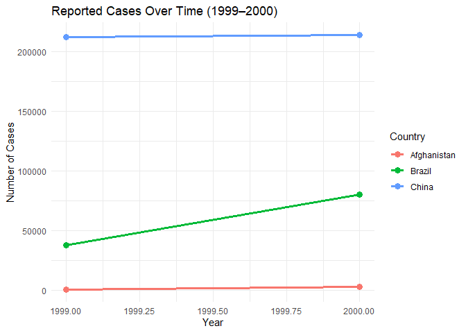

FA1_Lecture 4 - Cuerdo, Naomi Hannah A.
================
Cuerdo, Naomi Hannah A.
2025-02-01

# Lecture 4

## 2 Data Import

``` r
heights = read.csv("C:/Users/naomi/Downloads/heights.csv")

head(heights)
```

    ##    earn   height    sex ed age  race
    ## 1 50000 74.42444   male 16  45 white
    ## 2 60000 65.53754 female 16  58 white
    ## 3 30000 63.62920 female 16  29 white
    ## 4 50000 63.10856 female 16  91 other
    ## 5 51000 63.40248 female 17  39 white
    ## 6  9000 64.39951 female 15  26 white

## Tidy Data

**Generating the tables from the lecture:**

``` r
table1
```

    ## # A tibble: 6 × 4
    ##   country      year  cases population
    ##   <chr>       <dbl>  <dbl>      <dbl>
    ## 1 Afghanistan  1999    745   19987071
    ## 2 Afghanistan  2000   2666   20595360
    ## 3 Brazil       1999  37737  172006362
    ## 4 Brazil       2000  80488  174504898
    ## 5 China        1999 212258 1272915272
    ## 6 China        2000 213766 1280428583

In **table1**, each row represents a single **observation**, defined as
a unique combination of a country and a year. The dataset follows the
principles of **tidy data**, where:

The **country** column identifies the name of the country. The **year**
column specifies the year of observation. The **cases** column records
the number of reported cases in that country and year. The
**population** column provides the total population for that country and
year.

Each row contains a complete set of values for all variables, making it
easy to analyze and manipulate.

``` r
table2
```

    ## # A tibble: 12 × 4
    ##    country      year type            count
    ##    <chr>       <dbl> <chr>           <dbl>
    ##  1 Afghanistan  1999 cases             745
    ##  2 Afghanistan  1999 population   19987071
    ##  3 Afghanistan  2000 cases            2666
    ##  4 Afghanistan  2000 population   20595360
    ##  5 Brazil       1999 cases           37737
    ##  6 Brazil       1999 population  172006362
    ##  7 Brazil       2000 cases           80488
    ##  8 Brazil       2000 population  174504898
    ##  9 China        1999 cases          212258
    ## 10 China        1999 population 1272915272
    ## 11 China        2000 cases          213766
    ## 12 China        2000 population 1280428583

In **table2**, each row still represents a **country and a year**, but
the dataset is structured differently: Instead of having separate
columns for cases and population, these variables are combined into two
columns:

The **type** column indicates whether the row contains a value for cases
or population. The **count** column stores the numerical value
corresponding to the type column.

``` r
table3
```

    ## # A tibble: 6 × 3
    ##   country      year rate             
    ##   <chr>       <dbl> <chr>            
    ## 1 Afghanistan  1999 745/19987071     
    ## 2 Afghanistan  2000 2666/20595360    
    ## 3 Brazil       1999 37737/172006362  
    ## 4 Brazil       2000 80488/174504898  
    ## 5 China        1999 212258/1272915272
    ## 6 China        2000 213766/1280428583

**Table 3** still represents a **country and a year**, but instead of
having separate column for cases and population, these two variables are
**combined into a single column** called **rate**.

The **rate** column stores values in the form of a fraction (e.g.,
745/37765203), where the numerator represents cases, and the denominator
represents population.

However, this table is not tidy, because a single column contains two
variables, making it difficult to separate and analyze the data
efficiently.

``` r
table4a
```

    ## # A tibble: 3 × 3
    ##   country     `1999` `2000`
    ##   <chr>        <dbl>  <dbl>
    ## 1 Afghanistan    745   2666
    ## 2 Brazil       37737  80488
    ## 3 China       212258 213766

In **table4a,** each row represents a country, but the year variable is
not explicitly stored as a column.

The **years** (e.g., 1999, 2000) appear as separate column names. The
**values** in these columns represent cases reported in each respective
year.

This structure is considered wide format,wherein observations are spread
across multiple columns rather than organized as distinct variables in
separate rows. While this format is useful for presentation, it is **not
tidy** because the year variable is placed as column names instead of
having its own column.

``` r
table4b
```

    ## # A tibble: 3 × 3
    ##   country         `1999`     `2000`
    ##   <chr>            <dbl>      <dbl>
    ## 1 Afghanistan   19987071   20595360
    ## 2 Brazil       172006362  174504898
    ## 3 China       1272915272 1280428583

**Table 4b** represents a country, with population recorded for multiple
years. Each year is a separate column, with **population** as values.

This is **not considered as a tidy format**, as the **year** variable
should ideally be in its own column rather than spread across multiple
column names.

## 4 Pivoting

### 4.1 Longer

Pivoting Table 4a to a new pair of values:

``` r
table4a %>%
pivot_longer(cols = c(`1999`, `2000`), names_to = "year", values_to = "cases")
```

    ## # A tibble: 6 × 3
    ##   country     year   cases
    ##   <chr>       <chr>  <dbl>
    ## 1 Afghanistan 1999     745
    ## 2 Afghanistan 2000    2666
    ## 3 Brazil      1999   37737
    ## 4 Brazil      2000   80488
    ## 5 China       1999  212258
    ## 6 China       2000  213766

Tidying table4b in a similar fashion:

``` r
table4b %>%
pivot_longer(cols = c(`1999`, `2000`), names_to = "year", values_to = "population")
```

    ## # A tibble: 6 × 3
    ##   country     year  population
    ##   <chr>       <chr>      <dbl>
    ## 1 Afghanistan 1999    19987071
    ## 2 Afghanistan 2000    20595360
    ## 3 Brazil      1999   172006362
    ## 4 Brazil      2000   174504898
    ## 5 China       1999  1272915272
    ## 6 China       2000  1280428583

**Difference between the code for Table4a and Table4b**

- In **table4a**, the values in the selected columns represent the
  **number of cases**
- In **table4b**, the values represent the **population** for each year.

Hence, the code to execute this is similar, but we tweak **values_to**
since each table represents different variables. This transformation
ensures that **each variable has its own column**, making it easier to
analyze and visualize trends over time.

### 4.2 Wider

Tidying **table2** for an accurate table:

``` r
table2 %>%
  pivot_wider(names_from = type, values_from = count)
```

    ## # A tibble: 6 × 4
    ##   country      year  cases population
    ##   <chr>       <dbl>  <dbl>      <dbl>
    ## 1 Afghanistan  1999    745   19987071
    ## 2 Afghanistan  2000   2666   20595360
    ## 3 Brazil       1999  37737  172006362
    ## 4 Brazil       2000  80488  174504898
    ## 5 China        1999 212258 1272915272
    ## 6 China        2000 213766 1280428583

Tidying the simple tibble from the lecture:

``` r
tribble(
  ~pregnant, ~male, ~female,
  "yes", NA, 10,
  "no", 20, 12
) %>%
  pivot_longer(cols = c(male, female), names_to = "gender", values_to = "count")
```

    ## # A tibble: 4 × 3
    ##   pregnant gender count
    ##   <chr>    <chr>  <dbl>
    ## 1 yes      male      NA
    ## 2 yes      female    10
    ## 3 no       male      20
    ## 4 no       female    12

The given table is in an **untidy** format because the **gender
information** is stored in column names (male, female), instead of as
values in a single column. To tidy this, we need to use
**pivot_longer()** to reshape it into long format.

After tidying the data, each row now represents a single observation
(pregnancy status for one gender). Each column also represents only one
variable (pregnant, gender, and count).

This format makes it easier to analyze gender differences in pregnancy
status.

## 5 Joining

Calling the tidy versions of table4a and table4b:

``` r
tidy4a <- table4a %>%
pivot_longer(c(`1999`, `2000`), names_to = "year", values_to = "cases")
tidy4b <- table4b %>%
pivot_longer(c(`1999`, `2000`), names_to = "year", values_to = "population")
```

``` r
tidy4a
```

    ## # A tibble: 6 × 3
    ##   country     year   cases
    ##   <chr>       <chr>  <dbl>
    ## 1 Afghanistan 1999     745
    ## 2 Afghanistan 2000    2666
    ## 3 Brazil      1999   37737
    ## 4 Brazil      2000   80488
    ## 5 China       1999  212258
    ## 6 China       2000  213766

``` r
tidy4b
```

    ## # A tibble: 6 × 3
    ##   country     year  population
    ##   <chr>       <chr>      <dbl>
    ## 1 Afghanistan 1999    19987071
    ## 2 Afghanistan 2000    20595360
    ## 3 Brazil      1999   172006362
    ## 4 Brazil      2000   174504898
    ## 5 China       1999  1272915272
    ## 6 China       2000  1280428583

Since both tables have the same country, we can join these tables using
left_join() function:

``` r
left_join(x = tidy4a, y = tidy4b, by = c("country", "year"))
```

    ## # A tibble: 6 × 4
    ##   country     year   cases population
    ##   <chr>       <chr>  <dbl>      <dbl>
    ## 1 Afghanistan 1999     745   19987071
    ## 2 Afghanistan 2000    2666   20595360
    ## 3 Brazil      1999   37737  172006362
    ## 4 Brazil      2000   80488  174504898
    ## 5 China       1999  212258 1272915272
    ## 6 China       2000  213766 1280428583

**Exercise.** Consider the two tibbles below. What is the key column?
Without writing any code, can you predict how many rows and columns
left_join(x,y) and left_join(y,x) will have?

``` r
x <- tribble(
  ~state, ~population,
  "PA", 12.8,
  "TX", 28.6,
  "NY", 19.5
  )
y <- tribble(
  ~state, ~capital,
  "TX", "Austin",
  "CA", "Sacramento",
  "NY", "New York City",
  "MI", "Lansing"
  )
```

**Predicting left_join(x, y)** From the table: - x has **3 rows** (PA,
TX, NY). - y has 4 rows (TX, CA, NY, MI).

After the join: - TX and NY exist in both tables, so their capital
values from y will be added to x. - PA exists in x but not in y, so it
will get NA in the capital column. - CA and MI exist in y but not in x,
so they will be ignore in left_join(x, y). - The table will have 3 rows
and 3 columns.

**Predicting left_join(y, x)** The code keeps all rows from y and merges
matching rows from x.

After the join: - TX and NY exist in both tables, so their population
values from x will be added to y. - CA and MI exist in y but not in x,
so they will get NA in the population column. - PA exists in x but not
in y, so it will be ignored in left_join(y, x). - The table will have 4
columns and 3 columns

## 6 Separating

From table3, the rate column contains both cases and population
variables, and it needs to be splitted into two variables.

Using the separate() function, we get:

``` r
table3 %>%
  separate(rate, into = c("cases", "population"))
```

    ## # A tibble: 6 × 4
    ##   country      year cases  population
    ##   <chr>       <dbl> <chr>  <chr>     
    ## 1 Afghanistan  1999 745    19987071  
    ## 2 Afghanistan  2000 2666   20595360  
    ## 3 Brazil       1999 37737  172006362 
    ## 4 Brazil       2000 80488  174504898 
    ## 5 China        1999 212258 1272915272
    ## 6 China        2000 213766 1280428583

Rewriting the code to get a similar result:

``` r
table3 %>%
  separate(rate, into = c("cases", "population"), sep = "/")
```

    ## # A tibble: 6 × 4
    ##   country      year cases  population
    ##   <chr>       <dbl> <chr>  <chr>     
    ## 1 Afghanistan  1999 745    19987071  
    ## 2 Afghanistan  2000 2666   20595360  
    ## 3 Brazil       1999 37737  172006362 
    ## 4 Brazil       2000 80488  174504898 
    ## 5 China        1999 212258 1272915272
    ## 6 China        2000 213766 1280428583

From the table, we can see that **cases** and **population** are
character columns. We might need to convert to better types using
convert() = TRUE:

``` r
tibble3 <- table3 %>%
  separate(rate, into = c("cases", "population"), convert =
             TRUE)

tibble3
```

    ## # A tibble: 6 × 4
    ##   country      year  cases population
    ##   <chr>       <dbl>  <int>      <int>
    ## 1 Afghanistan  1999    745   19987071
    ## 2 Afghanistan  2000   2666   20595360
    ## 3 Brazil       1999  37737  172006362
    ## 4 Brazil       2000  80488  174504898
    ## 5 China        1999 212258 1272915272
    ## 6 China        2000 213766 1280428583

``` r
data <- tibble3

ggplot(data, aes(x = year, y = cases, group = country, color = country)) +
  geom_line(size = 1.2) +
  geom_point(size = 3) +
  labs(title = "Reported Cases Over Time (1999–2000)",
       x = "Year",
       y = "Number of Cases",
       color = "Country") +
  theme_minimal()
```

    ## Warning: Using `size` aesthetic for lines was deprecated in ggplot2 3.4.0.
    ## ℹ Please use `linewidth` instead.
    ## This warning is displayed once every 8 hours.
    ## Call `lifecycle::last_lifecycle_warnings()` to see where this warning was
    ## generated.

<!-- -->

This data set contains reported cases and population data for
Afghanistan, Brazil, and China across 1999 and 2000 was analyzed.
Population growth was observed in all three countries. China had the
largest population, followed by Brazil and Afghanistan.

When examining cases per population, Afghanistan exhibited the largest
relative increase (0.0037% to 0.0129%), suggesting a notable rise in
reported infections. Brazil also showed a significant increase (0.022%
to 0.046%). In contrast, China’s incidence rate remained nearly
unchanged (~0.0167%). These trends highlight variations in case growth
relative to population size across different regions.

## 7 Missing Values

``` r
stocks <- tibble(
  year = c(2015, 2015, 2015, 2015, 2016, 2016, 2016),
  qtr = c( 1, 2, 3, 4, 2, 3, 4),
  return = c(1.88, 0.59, 0.35, NA, 0.92, 0.17, 2.66)
)

stocks
```

    ## # A tibble: 7 × 3
    ##    year   qtr return
    ##   <dbl> <dbl>  <dbl>
    ## 1  2015     1   1.88
    ## 2  2015     2   0.59
    ## 3  2015     3   0.35
    ## 4  2015     4  NA   
    ## 5  2016     2   0.92
    ## 6  2016     3   0.17
    ## 7  2016     4   2.66

From the table, we can see that there is a missing value in the fourth
row. We might need to clean the data.

Pivoting the data set wider:

``` r
stocks %>%
  pivot_wider(names_from = year, values_from = return)
```

    ## # A tibble: 4 × 3
    ##     qtr `2015` `2016`
    ##   <dbl>  <dbl>  <dbl>
    ## 1     1   1.88  NA   
    ## 2     2   0.59   0.92
    ## 3     3   0.35   0.17
    ## 4     4  NA      2.66

omitting the missing values:

``` r
tribble4 <- stocks %>%
  na.omit()

tribble4
```

    ## # A tibble: 6 × 3
    ##    year   qtr return
    ##   <dbl> <dbl>  <dbl>
    ## 1  2015     1   1.88
    ## 2  2015     2   0.59
    ## 3  2015     3   0.35
    ## 4  2016     2   0.92
    ## 5  2016     3   0.17
    ## 6  2016     4   2.66
