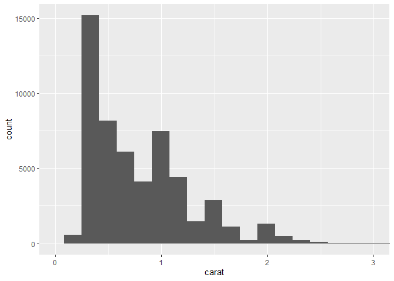
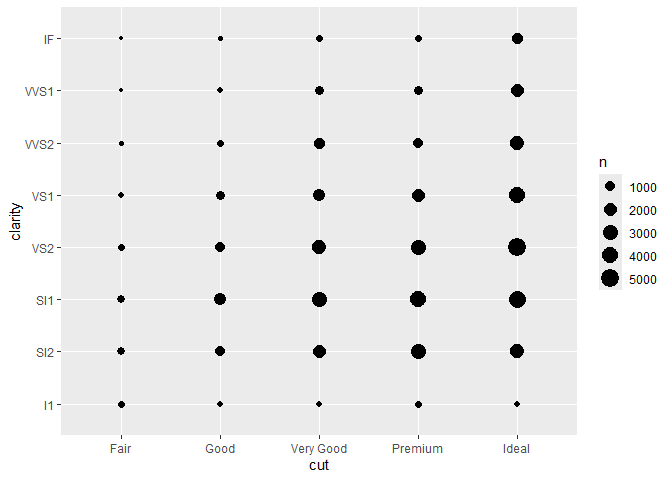
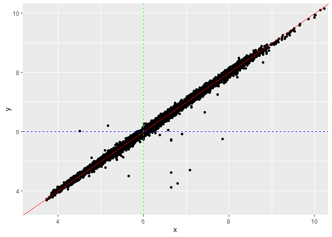
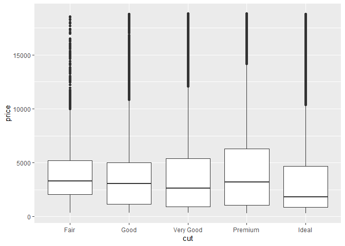

FA1
================
Cuerdo, Naomi Hannah A.
2025-02-01

# Lecture 2

## Case Study: Diamonds

### Loading the Library

``` r
diamonds
```

    ## # A tibble: 53,940 × 10
    ##    carat cut       color clarity depth table price     x     y     z
    ##    <dbl> <ord>     <ord> <ord>   <dbl> <dbl> <int> <dbl> <dbl> <dbl>
    ##  1  0.23 Ideal     E     SI2      61.5    55   326  3.95  3.98  2.43
    ##  2  0.21 Premium   E     SI1      59.8    61   326  3.89  3.84  2.31
    ##  3  0.23 Good      E     VS1      56.9    65   327  4.05  4.07  2.31
    ##  4  0.29 Premium   I     VS2      62.4    58   334  4.2   4.23  2.63
    ##  5  0.31 Good      J     SI2      63.3    58   335  4.34  4.35  2.75
    ##  6  0.24 Very Good J     VVS2     62.8    57   336  3.94  3.96  2.48
    ##  7  0.24 Very Good I     VVS1     62.3    57   336  3.95  3.98  2.47
    ##  8  0.26 Very Good H     SI1      61.9    55   337  4.07  4.11  2.53
    ##  9  0.22 Fair      E     VS2      65.1    61   337  3.87  3.78  2.49
    ## 10  0.23 Very Good H     VS1      59.4    61   338  4     4.05  2.39
    ## # ℹ 53,930 more rows

## 3 Variations

### 3.1 Discrete Variable

``` r
ggplot(data = diamonds) +
  geom_bar(mapping = (aes(x = cut)))
```

<!-- -->

Figure 1 above shows a bar graph of the distribution of different
diamond cuts, categorized as **Fair, Good, Very Good, Premium, and
Ideal**. The y-axis represents the count of diamonds for each cut,
providing insight into the most and least common types of diamond cuts.

From Figure 1,**Ideal** is the most common cut, with a frequency of
20,000 diamonds, followed by **Premium** and **Very Good**. This
suggests that **ideal-cut diamonds** are the most preferred, possibly
due to their brilliance and market demand. **Good** cut is moderately
frequent, with a frequency of 5,000 diamonds.

On the other hand, The graph also shows that fair cut is the least
common cut, suggesting that diamonds are either less desirable or less
frequently produced. This trend suggests a strong market preference for
higher-quality cuts, likely due to their superior brilliance and appeal.

### 3.2 Continuous variables

``` r
ggplot(data = diamonds) +
geom_histogram(mapping = aes(x = carat))
```

    ## `stat_bin()` using `bins = 30`. Pick better value with `binwidth`.

<!-- -->
Figure 2 about shows a histogram of the frequency of carat
distributions. From figure 2, it shows that most of the values of carat
are below 3, so it is best to zoom in to the portion of the plot.

``` r
ggplot(data = diamonds) +
  geom_histogram(mapping = aes(x = carat)) +
  coord_cartesian(xlim = c(0,3))
```

    ## `stat_bin()` using `bins = 30`. Pick better value with `binwidth`.

<!-- -->
Figure 3 seems to have an error with the bin width. Decreasing the bin
width of the graph for better visualization:

``` r
ggplot(data = diamonds) +
  geom_histogram(mapping = aes(x = carat), binwidth = 0.01)
```

<!-- -->

``` r
coord_cartesian(xlim = c(0,3))
```

    ## <ggproto object: Class CoordCartesian, Coord, gg>
    ##     aspect: function
    ##     backtransform_range: function
    ##     clip: on
    ##     default: FALSE
    ##     distance: function
    ##     expand: TRUE
    ##     is_free: function
    ##     is_linear: function
    ##     labels: function
    ##     limits: list
    ##     modify_scales: function
    ##     range: function
    ##     render_axis_h: function
    ##     render_axis_v: function
    ##     render_bg: function
    ##     render_fg: function
    ##     setup_data: function
    ##     setup_layout: function
    ##     setup_panel_guides: function
    ##     setup_panel_params: function
    ##     setup_params: function
    ##     train_panel_guides: function
    ##     transform: function
    ##     super:  <ggproto object: Class CoordCartesian, Coord, gg>

Figure 4 shows the distribution of carat values. The x-axis represents
the **carat values**, while the y-axis represents the count of diamonds
for each bin, with a bin width of 0.01.

Most of the diamonds have small carat values below 1. The distribution
is **right-skewed**. There are noticeable spikers at common carat sizes
(e.g., **0.25, 0.5, 0.75, 1.0 carats **), suggesting certain
standardized weights are more frequently produced or preferred by
consumers. As carat increases beyond **2 carats**, the count drops
significantly, indicating that **large diamonds are much rarer.**

## 4 Covariation

### 4.1 Discrete versus discrete.

``` r
ggplot(data = diamonds) +
  geom_count(mapping = aes(x = cut, y = clarity))
```

<!-- -->

The bubble chart above (Figure 5) between **diamond cut** and
**clarity**, where the size of each bubble represents the count of
diamonds in each category.

From the chart, **Ideal cut dominates**, wherein most diamonds, across
all clarity levels have an **ideal cut**, suggesting high consumer
preference. **Premium** and *Very Good* cuts are also common, where they
have substantial representation across different clarity grades. Fewer
diamonds with **Fair** and **Good ** cuts appear less frequently.

Overall, **clarity distribution is fairly even**, suggesting that no
single clarity grade overwhelmingly dominates any cut category, though
**VS2** and **SI1** seem more common overall.

### 4.2 Continuous versus continuous

#### 4.2.1 Many to one

``` r
ggplot(data = diamonds) +
  geom_point(mapping = aes(x = x, y = y))
```

<!-- -->

omitting the outliers, we get:

``` r
ggplot(data = diamonds) +
  geom_point(mapping = aes(x = x, y = y)) +
  coord_cartesian(xlim = c(3.5, 10), ylim = c(3.5,10))
```

<!-- -->

From the graph, it seems that most of the points lie on the line y = x.
To confirm this, we shall add a line:

``` r
ggplot(data = diamonds) + 
  geom_point(mapping = aes(x = x, y = y)) +
  geom_abline(slope = 1, intercept = 0, color = "red") +
  geom_hline(yintercept = 6, color = "blue", linetype = "dashed") +
  geom_vline(xintercept = 6, color = "green", linetype = "dashed") + 
  coord_cartesian(xlim = c(3.5, 10), ylim = c(3.5,10)) 
```

<!-- -->

Figure 6 shows a scatter plot of the relationship between the x
(length)and y (width) dimensions of diamonds in the data set. The red
diagonal line helps assess how closely x and y values match. The blue
and green dashed lines serve as thresholds to categorize diamonds based
on their dimensions.

The points near the red line indicate that diamonds have nearly equal
length and width. The diamonds that width greater than 6 units are above
the red line, while those smaller are below it. The green line shows the
diamonds with greater length than 6 units are to the right, while the
smaller ones are to the left.

Overall, the graph offers a clear picture of the relationships between
length and width of the diamonds, which gives us a result of equal sizes
in both dimensions.

#### 4.2.2 One to one

We now then proceed to visualize the average diamond price for each
value of the carat.

``` r
avg_price_by_carat <- diamonds %>%
  mutate(carat = round(carat, 1)) %>%
  group_by(carat) %>%
  summarise(avg_price = mean(price))
avg_price_by_carat
```

    ## # A tibble: 38 × 2
    ##    carat avg_price
    ##    <dbl>     <dbl>
    ##  1   0.2      506.
    ##  2   0.3      709.
    ##  3   0.4      936.
    ##  4   0.5     1590.
    ##  5   0.6     1861.
    ##  6   0.7     2619.
    ##  7   0.8     2998.
    ##  8   0.9     3942.
    ##  9   1       5437.
    ## 10   1.1     6011.
    ## # ℹ 28 more rows

Plotting the avg_price versus carat using a line plot:

``` r
ggplot(data = avg_price_by_carat) +
  geom_line(mapping = aes(x = carat, y = avg_price))
```

<!-- -->
Figure 7 shows a line graph how diamond prices increase with carat size.
From the plot, it shows that the price peaks at carat size 5, with a
price range of around 20,000. However, The price dropped at sizes drop
at around size 3 and 4, which indicates that the line is not entirely
smooth as there are fluctuations with the price increase.

The graph makes sense since larger diamonds tend to be rarer and more
desirable. The fluctuations may be due to **data variability, outliers,
or market demand for certain carat sizes.**

### 4.3 Continuous versus discrete

``` r
ggplot(data = diamonds) + 
  geom_boxplot(mapping = aes(x = cut, y = price))
```

<!-- -->

### 4.4 Correlation matrices

Computing for the correlation matrix:

``` r
corrmat <- cor(diamonds[, sapply(diamonds, is.numeric)], use = "complete.obs")
```

``` r
corrmat
```

    ##            carat       depth      table      price           x           y
    ## carat 1.00000000  0.02822431  0.1816175  0.9215913  0.97509423  0.95172220
    ## depth 0.02822431  1.00000000 -0.2957785 -0.0106474 -0.02528925 -0.02934067
    ## table 0.18161755 -0.29577852  1.0000000  0.1271339  0.19534428  0.18376015
    ## price 0.92159130 -0.01064740  0.1271339  1.0000000  0.88443516  0.86542090
    ## x     0.97509423 -0.02528925  0.1953443  0.8844352  1.00000000  0.97470148
    ## y     0.95172220 -0.02934067  0.1837601  0.8654209  0.97470148  1.00000000
    ## z     0.95338738  0.09492388  0.1509287  0.8612494  0.97077180  0.95200572
    ##                z
    ## carat 0.95338738
    ## depth 0.09492388
    ## table 0.15092869
    ## price 0.86124944
    ## x     0.97077180
    ## y     0.95200572
    ## z     1.00000000

``` r
ggcorrplot(corrmat, lab=TRUE, hc.order = TRUE)
```

<!-- -->
Figure 8 above reveals strong positive relationships between carat,
price, and the dimensions (x, y, z), with correlations **0.95-0.98**.

This plot indicates that larger diamonds tend to be more expensive in
carat weight and physical dimensions. The dimensions x, y, and z are
also highly correlated with each other, which serves as a reference of
carat and its price.

In contrasts, **table and depth** show much weaker relationships with
price, with having a **low correlation of 0.13** and **depth showing
almost no correlation (-0.01)**. Additionally, there is a **moderate
negative correlation (-0.3)** between **table and depth**, suggesting an
inverse relationships in how diamonds are cut.

Overall, **carat and dimensions** are the primary source of its price,
while **depth and table** have minimal influence.

## 5 Additional visualization tools

### 5.1 Axis transformations

``` r
ggplot(data = diamonds) +
geom_histogram(aes(x = carat), binwidth = 0.01) +
scale_x_log10()
```

<!-- -->

Figure 9 shows a histogram of carats size in a logarithmic scale for the
x axis. The carat distribution is right-skewed, meaning most diamonds
have smaller carat values, with fewer large-carat diamonds.

The plot uses a log10 scaling that helps spread out smaller values,
making the patterns and density more interpretable.

Furthermore, also shows that carat size 1.0 is the most popular,
followed by 0.5 and 1.5.

Plotting the variables on the y-axis:

``` r
ggplot(data = diamonds) +
geom_point(aes(x = carat, y = price)) +
scale_x_log10() +
scale_y_log10()
```

<!-- -->

Figure 10 shows a scatter plot between variables carat (x-axis) and
price (y-axis). This plot further solidifies that carats with much
higher prices have minimal occurrences in the graph, which indicates
that carats with larger sizes are rare to find.

### 5.2 Multiple geoms in the same plot

``` r
ggplot(data = avg_price_by_carat, mapping = aes(x = carat, y = avg_price)) +
geom_line() +
geom_point()
```

<!-- -->

Figure 11 shows a line graph how diamond prices increase with carat
size. From the plot, it shows that the price peaks at carat size 5, with
a price range of around 20,000. However, The price dropped at sizes drop
at around size 3 and 4 to around 10,000 and 15, 0000, which indicates
that the line is not entirely smooth as there are fluctuations with the
price increase.

### 5.3 Multiple aesthetics in the same geom

adding a color for the scatter plot:

``` r
ggplot(data = diamonds) +
  geom_point(mapping = aes(x = carat, y = price, color = cut))
```

<!-- -->

Figure 12 shows a plot between the relationship between the carat and
price, with data points categorized by cut quality.

From the plot, there is a **clear positive correlation**, where price
generally increases with carat size. Higher-quality cuts, such as
**“Ideal” and “Premium,”** tend to be priced higher, even at lower carat
sizes, indicating that cut significantly impacts value. The distribution
of points shows that **smaller diamonds are more common, while larger
diamonds are rarer and more expensive.**

Additionally, some outliers suggest that factors beyond carat and cut,
such as clarity and color, influence pricing. Overall, the graph
highlights the complex pricing structure of diamonds, where both size
and quality contribute to their market value.

### 5.4 Faceting

``` r
ggplot(data = diamonds) +
  geom_point(mapping = aes(x = carat, y = price)) +
  facet_wrap(~cut)
```

<!-- -->

``` r
ggplot(data = diamonds) +
  geom_point(mapping = aes(x = carat, y = price)) +
  facet_grid(. ~ cut)
```

<!-- -->
Figures 12 and 13 show scatter plots between carat and its price per
cut. The plot shows that fair cuts are much frequent in the lower price
range, while higher prices are much frequent in very good, premium, and
ideal. The ideal cut, however, tends to be more frequent in all price
ranges, indicating that the ideal cut is the most common in diamonds.

``` r
ggplot(data = diamonds) +
  geom_point(mapping = aes(x = carat, y = price)) +
  facet_grid(clarity ~ cut)
```

<!-- -->

Figure 15 shows a faceted scatter plot of how diamond price varies with
carat size, categorized by **cut quality (columns)** and **clarity
(rows).** Price generally increases with carat, but higher cut quality
**(Ideal, Premium)** and **better clarity (IF, VVS1, VVS2)** result in
significantly higher prices, while **lower clarity and cut grades (e.g.,
I1, Fair)** tend to have lower prices even for larger carats.

The plot highlights how carat, cut, and clarity collectively influence
diamond pricing, with premium cuts and higher clarity diamonds
commanding the highest values.

## 7 Exercises

### 7.1 Relating the carat and cut of a diamond

``` r
ggplot(diamonds, aes(x = cut, y = carat, fill = cut)) +
  geom_boxplot() +
  theme_minimal() +
  labs(title = "Distribution of Carat Size by Cut Quality",
       x = "Cut Quality",
       y = "Carat Size") +
  scale_fill_brewer(palette = "Pastel1")
```

<!-- -->

The first scatter plot shows that while price generally increases with
carat size, higher-quality cuts (Ideal, Premium) are more common in
smaller carat ranges, whereas lower-quality cuts (Fair, Good) extend to
larger carat sizes. This suggests an inverse relationship between carat
and cut quality, where larger diamonds often have lower cut grades.

A box plot of carat size by cut category would further confirm this
trend, showing that diamonds with better cuts tend to be smaller. This
explains the paradox in the first plot, where some smaller diamonds are
priced higher than larger ones.
