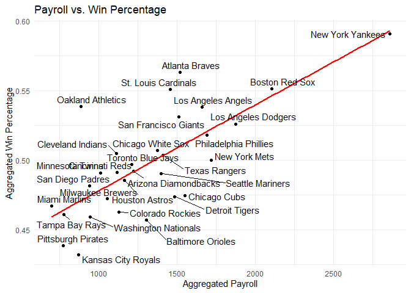

FA3_Cuerdo, Naomi Hannah A.
================
Cuerdo, Naomi Hannah A.
2025-02-22

# Major League Basketball

## Import the Data

``` r
mlb_raw <- as_tibble(ml_pay)
print(mlb_raw)
```

    ## # A tibble: 30 × 54
    ##    payroll avgwin Team.name.2014 p1998 p1999 p2000 p2001 p2002 p2003 p2004 p2005
    ##      <dbl>  <dbl> <fct>          <dbl> <dbl> <dbl> <dbl> <dbl> <dbl> <dbl> <dbl>
    ##  1   1.12   0.490 Arizona Diamo…  31.6  70.5  81.0  81.2 103.   80.6  70.2  63.0
    ##  2   1.38   0.553 Atlanta Braves  61.7  74.9  84.5  91.9  93.5 106.   88.5  85.1
    ##  3   1.16   0.454 Baltimore Ori…  71.9  72.2  81.4  72.4  60.5  73.9  51.2  74.6
    ##  4   1.97   0.549 Boston Red Sox  59.5  71.7  77.9 110.  108.   99.9 125.  121. 
    ##  5   1.46   0.474 Chicago Cubs    49.8  42.1  60.5  64.0  75.7  79.9  91.1  87.2
    ##  6   1.32   0.511 Chicago White…  35.2  24.5  31.1  62.4  57.1  51.0  65.2  75.2
    ##  7   1.02   0.486 Cincinnati Re…  20.7  73.3  46.9  45.2  45.1  59.4  43.1  59.7
    ##  8   0.999  0.496 Cleveland Ind…  59.5  54.4  75.9  92.0  78.9  48.6  34.6  41.8
    ##  9   1.03   0.463 Colorado Rock…  47.7  55.4  61.1  71.1  56.9  67.2  64.6  47.8
    ## 10   1.43   0.482 Detroit Tigers  19.2  35.0  58.3  49.8  55.0  49.2  46.4  69.0
    ## # ℹ 20 more rows
    ## # ℹ 43 more variables: p2006 <dbl>, p2007 <dbl>, p2008 <dbl>, p2009 <dbl>,
    ## #   p2010 <dbl>, p2011 <dbl>, p2012 <dbl>, p2013 <dbl>, p2014 <dbl>,
    ## #   X2014 <int>, X2013 <int>, X2012 <int>, X2011 <int>, X2010 <int>,
    ## #   X2009 <int>, X2008 <int>, X2007 <int>, X2006 <int>, X2005 <int>,
    ## #   X2004 <int>, X2003 <int>, X2002 <int>, X2001 <int>, X2000 <int>,
    ## #   X1999 <int>, X1998 <int>, X2014.pct <dbl>, X2013.pct <dbl>, …

The table contains 30 rows and 54 columns which matches the data
description.

## Tidying the Data

``` r
payroll_long <-mlb_raw %>%
    pivot_longer(
    cols = matches("^p\\d{4}$"), 
    names_to = "Year",
    names_prefix="p",
    values_to = "Payroll_p_year"
  )
  
wins_long <- mlb_raw %>%
    pivot_longer(
    cols = matches("^p\\d{4}$"), 
    names_to = "Year",
    names_prefix="X",
    values_to = "num_wins"
  )

wins_pct_long <- mlb_raw %>%
    pivot_longer(
    cols = matches("^X\\d{4}\\.pct$"), 
    names_to = "Year",
    names_prefix="X",
    values_to = "pct_wins"
  ) %>% 
  mutate(Year = str_remove(Year, "\\.pct$"))

df_list <-list(payroll_long, wins_long, wins_pct_long)

tidy_data <- reduce(df_list, left_join, by = c("Team.name.2014", "Year"))

tidy_data <- tidy_data %>%
  select(-matches("^p\\d{4}$"), -matches("^X\\d{4}$"), -matches("^X\\d{4}\\.pct$"))

tidy_data <- tidy_data %>%
  select(-matches("\\.x$")) %>%
  select(-matches("\\.y$"))

tidy_data <- tidy_data %>%
  mutate(Payroll_p_year = as.numeric(Payroll_p_year))


tidy_data <- tidy_data %>%
  rename(team = Team.name.2014)

tidy_data
```

    ## # A tibble: 510 × 7
    ##    team                 Year  Payroll_p_year num_wins payroll avgwin pct_wins
    ##    <fct>                <chr>          <dbl>    <dbl>   <dbl>  <dbl>    <dbl>
    ##  1 Arizona Diamondbacks 1998            31.6       NA    1.12  0.490    0.399
    ##  2 Arizona Diamondbacks 1999            70.5       NA    1.12  0.490    0.613
    ##  3 Arizona Diamondbacks 2000            81.0       NA    1.12  0.490    0.525
    ##  4 Arizona Diamondbacks 2001            81.2       NA    1.12  0.490    0.568
    ##  5 Arizona Diamondbacks 2002           103.        NA    1.12  0.490    0.605
    ##  6 Arizona Diamondbacks 2003            80.6       NA    1.12  0.490    0.519
    ##  7 Arizona Diamondbacks 2004            70.2       NA    1.12  0.490    0.315
    ##  8 Arizona Diamondbacks 2005            63.0       NA    1.12  0.490    0.475
    ##  9 Arizona Diamondbacks 2006            59.7       NA    1.12  0.490    0.469
    ## 10 Arizona Diamondbacks 2007            52.1       NA    1.12  0.490    0.552
    ## # ℹ 500 more rows

Now that the data has been tidy, we need to create two more tables:
**mlb_aggregate and mlb_yearly** using **tidy_data**

``` r
mlb_aggregate <-mlb_raw %>%
  select(Team.name.2014, payroll, avgwin) %>%
  rename(team = Team.name.2014)

mlb_aggregate
```

    ## # A tibble: 30 × 3
    ##    team                 payroll avgwin
    ##    <fct>                  <dbl>  <dbl>
    ##  1 Arizona Diamondbacks   1.12   0.490
    ##  2 Atlanta Braves         1.38   0.553
    ##  3 Baltimore Orioles      1.16   0.454
    ##  4 Boston Red Sox         1.97   0.549
    ##  5 Chicago Cubs           1.46   0.474
    ##  6 Chicago White Sox      1.32   0.511
    ##  7 Cincinnati Reds        1.02   0.486
    ##  8 Cleveland Indians      0.999  0.496
    ##  9 Colorado Rockies       1.03   0.463
    ## 10 Detroit Tigers         1.43   0.482
    ## # ℹ 20 more rows

``` r
mlb_yearly <-tidy_data %>%
  select(-payroll, -avgwin)

mlb_yearly
```

    ## # A tibble: 510 × 5
    ##    team                 Year  Payroll_p_year num_wins pct_wins
    ##    <fct>                <chr>          <dbl>    <dbl>    <dbl>
    ##  1 Arizona Diamondbacks 1998            31.6       NA    0.399
    ##  2 Arizona Diamondbacks 1999            70.5       NA    0.613
    ##  3 Arizona Diamondbacks 2000            81.0       NA    0.525
    ##  4 Arizona Diamondbacks 2001            81.2       NA    0.568
    ##  5 Arizona Diamondbacks 2002           103.        NA    0.605
    ##  6 Arizona Diamondbacks 2003            80.6       NA    0.519
    ##  7 Arizona Diamondbacks 2004            70.2       NA    0.315
    ##  8 Arizona Diamondbacks 2005            63.0       NA    0.475
    ##  9 Arizona Diamondbacks 2006            59.7       NA    0.469
    ## 10 Arizona Diamondbacks 2007            52.1       NA    0.552
    ## # ℹ 500 more rows

**mlb_aggregate** has 30 rows, while **mlb_yearly** has 510 rows.
**mlb_yearly** has more rows than **mlb_aggregate** since **mlb_yearly**
records the wins of teams year by year, percentage, and its payroll per
year. The **mlb_aggregate** only shows the total payroll and average
wins.

## Quality Control

``` r
mlb_aggregate_computed <- mlb_yearly %>%
  group_by(team) %>%
  summarise(
    payroll_aggregate_computed = sum(Payroll_p_year, na.rm = TRUE),
    pct_wins_aggregate_computed = mean(pct_wins, na.rm = TRUE)
  )

mlb_aggregate_computed
```

    ## # A tibble: 30 × 3
    ##    team                 payroll_aggregate_computed pct_wins_aggregate_computed
    ##    <fct>                                     <dbl>                       <dbl>
    ##  1 Arizona Diamondbacks                      1223.                       0.492
    ##  2 Atlanta Braves                            1518.                       0.563
    ##  3 Baltimore Orioles                         1305.                       0.457
    ##  4 Boston Red Sox                            2104.                       0.551
    ##  5 Chicago Cubs                              1552.                       0.475
    ##  6 Chicago White Sox                         1375.                       0.507
    ##  7 Cincinnati Reds                           1119.                       0.491
    ##  8 Cleveland Indians                         1113.                       0.505
    ##  9 Colorado Rockies                          1129.                       0.463
    ## 10 Detroit Tigers                            1484.                       0.474
    ## # ℹ 20 more rows

``` r
mlb_aggregate_joined <- mlb_aggregate %>%
  left_join(mlb_aggregate_computed, by = "team")

mlb_aggregate_joined
```

    ## # A tibble: 30 × 5
    ##    team             payroll avgwin payroll_aggregate_co…¹ pct_wins_aggregate_c…²
    ##    <fct>              <dbl>  <dbl>                  <dbl>                  <dbl>
    ##  1 Arizona Diamond…   1.12   0.490                  1223.                  0.492
    ##  2 Atlanta Braves     1.38   0.553                  1518.                  0.563
    ##  3 Baltimore Oriol…   1.16   0.454                  1305.                  0.457
    ##  4 Boston Red Sox     1.97   0.549                  2104.                  0.551
    ##  5 Chicago Cubs       1.46   0.474                  1552.                  0.475
    ##  6 Chicago White S…   1.32   0.511                  1375.                  0.507
    ##  7 Cincinnati Reds    1.02   0.486                  1119.                  0.491
    ##  8 Cleveland India…   0.999  0.496                  1113.                  0.505
    ##  9 Colorado Rockies   1.03   0.463                  1129.                  0.463
    ## 10 Detroit Tigers     1.43   0.482                  1484.                  0.474
    ## # ℹ 20 more rows
    ## # ℹ abbreviated names: ¹​payroll_aggregate_computed,
    ## #   ²​pct_wins_aggregate_computed

Visualizing **mlb_aggregate_joined** with scatter plots, comparing
**payroll_aggregate_computed** vs **payroll_aggregate**, and
**pct_wins_aggregate_computed vs pct_wins_aggregate**

``` r
payroll_scatter <- ggplot(mlb_aggregate_joined, aes(x=payroll_aggregate_computed, y = payroll, label = team)) +
  geom_point() +
  geom_abline(slope = 1, intercept = 0, linetype = "dashed", color = "red") +
  labs(title = "Aggregated vs. Provided Payroll", x = "Aggregated Payroll", y = "Provided Payroll")

win_pct_scatter <- ggplot(mlb_aggregate_joined, aes(x=pct_wins_aggregate_computed, y = avgwin, label = team)) +
  geom_point() +
  geom_abline(slope = 1, intercept = 0, linetype = "dashed", color = "red") +
  labs(title = "Aggregated vs. Provided Win %", x = "Aggregated Win %", y = "Provided % Win")

payroll_scatter + win_pct_scatter
```

<!-- -->

Comparing the two graphs above, we can conclude that the computed
payroll and win percentage have no significant difference, indicating
that no errors are present in the computed payroll and win percentage.

## Visualization

### Payroll across years

``` r
payroll_year <- ggplot(tidy_data, aes(x = Year, y = Payroll_p_year, group = team, color = team)) +
  geom_line() +
  geom_hline(aes(yintercept = mean(Payroll_p_year)), linetype = "dashed", color = "purple") +
  facet_wrap(~ team, scales = "free_y") +
  labs(title = "Payroll Across Years", x = "Year", y = "Payroll") +
  theme_minimal()

payroll_year
```

<!-- -->

Identifying the the three teams with the greatest payroll_aggregated
computed:

``` r
top_payroll_teams <- mlb_aggregate_computed %>%
  arrange(desc(payroll_aggregate_computed)) %>%
  slice_head(n = 3)

top_payroll_teams
```

    ## # A tibble: 3 × 3
    ##   team                payroll_aggregate_computed pct_wins_aggregate_computed
    ##   <fct>                                    <dbl>                       <dbl>
    ## 1 New York Yankees                         2857.                       0.591
    ## 2 Boston Red Sox                           2104.                       0.551
    ## 3 Los Angeles Dodgers                      1874.                       0.526

The Top Three teams are: New York Yankees (1st), Boston Red Sox (2nd),
and Los Angeles Dodgers (3rd).

Identifying the three teams with the greatest percentage increase in
payroll from 1998 to 2014:

``` r
payroll_growth <- mlb_yearly %>%
  filter(Year  %in% c(1998, 2014)) %>%
  select(team, Year, Payroll_p_year) %>%
  pivot_wider(names_from = Year, values_from = Payroll_p_year, names_prefix = "Payroll_") %>%
  mutate(pct_increase = (Payroll_2014 - Payroll_1998) / Payroll_1998 * 100) %>%
  arrange(desc(pct_increase)) %>%
  slice_head(n = 3)

payroll_growth
```

    ## # A tibble: 3 × 4
    ##   team                  Payroll_1998 Payroll_2014 pct_increase
    ##   <fct>                        <dbl>        <dbl>        <dbl>
    ## 1 Washington Nationals          8.32         135.        1520.
    ## 2 Detroit Tigers               19.2          162.         743.
    ## 3 Philadelphia Phillies        28.6          180.         529.

The Top Three teams with the greatest increase in payroll from 1998 to
\`2014 are: Washington Nationals, Detroit Tigers, and Philadelphia
Phillies.

The top 3 payroll teams have been having consistent high payroll per
year, which can be seen in the plot. The top 3 also are lying above the
average of the payrolls

The 3 teams for percentage increase have a more steeper increase.

### Win Percentage Across Years

``` r
pct_wins_plot <- ggplot(tidy_data, aes(x = Year, y = pct_wins, group = team, color = team)) +
  geom_line() +
  geom_hline(aes(yintercept = mean(pct_wins)), linetype = "dashed", color = "purple") +
  facet_wrap(~ team, scales = "free_y") +
  labs(title = "Win Percentage Across Years", x = "Year", y = "pct_wins") +
  theme_minimal()

pct_wins_plot
```

<!-- -->
Identifying the first three teams with the greatest
**pct_wins_aggregate_computed**

``` r
top_pct_teams <- mlb_aggregate_computed %>%
  arrange(desc(pct_wins_aggregate_computed)) %>%
  slice_head(n = 3)

top_pct_teams
```

    ## # A tibble: 3 × 3
    ##   team             payroll_aggregate_computed pct_wins_aggregate_computed
    ##   <fct>                                 <dbl>                       <dbl>
    ## 1 New York Yankees                      2857.                       0.591
    ## 2 Atlanta Braves                        1518.                       0.563
    ## 3 Boston Red Sox                        2104.                       0.551

The top three teams with the highest payroll are: New York Yankees,
Atlanta Braves, and Boston Red Sox.

Identifying the three teams with the most erratic percentage wins across
years measured by standard deviation

``` r
sd_teams <- mlb_yearly %>%
  group_by(team) %>%
  summarize(pct_wins_sd = sd(pct_wins, na.rm = TRUE)) %>%
  arrange(desc(pct_wins_sd)) %>%
  slice_head(n = 3)

sd_teams
```

    ## # A tibble: 3 × 2
    ##   team             pct_wins_sd
    ##   <fct>                  <dbl>
    ## 1 Houston Astros        0.0914
    ## 2 Detroit Tigers        0.0898
    ## 3 Seattle Mariners      0.0892

The top three teams with the erratic percentage in standard deviation
are: Houston Astros, Detroit Tigers, and Seattle Mariners.

The results from the **dpylr** amd from the plot coincide in the top 3
percentage. As an example, the New York Yankees had the highest payroll
account to 70%, but it dropped by 59% as years go by.

Similarly, in the top 3 teams with the highest standard deviation,
Houston Astros has the highest sd, which can be seen in the plot that
goes down as time goes by.

### Win Percentage versus Payroll

``` r
win_pct_payroll <-  ggplot(mlb_aggregate_joined, aes(x = payroll_aggregate_computed, y = pct_wins_aggregate_computed, label = team)) +
  geom_point() +
  geom_smooth(method = "lm", se = FALSE, color = "red") +
  geom_text_repel(max.overlaps = Inf) +
  theme_minimal() +
  labs(title = "Payroll vs. Win Percentage", x = "Aggregated Payroll", y= "Aggregated Win Percentage")

win_pct_payroll
```

    ## `geom_smooth()` using formula = 'y ~ x'

    ## Warning: The following aesthetics were dropped during statistical transformation: label.
    ## ℹ This can happen when ggplot fails to infer the correct grouping structure in
    ##   the data.
    ## ℹ Did you forget to specify a `group` aesthetic or to convert a numerical
    ##   variable into a factor?

<!-- -->

From the graph above, it seems that there is a positive relationship
between the aggregated payroll and the aggregated win percentage of the
teams. As the aggregated payroll increases, the aggregated win
percentage also increases.

## Team Efficiency

``` r
mlb_aggregate_joined <- mlb_aggregate_joined %>%
  mutate(Efficiency = pct_wins_aggregate_computed / payroll_aggregate_computed )

team_efficiency <- ggplot(mlb_aggregate_joined, aes(x = reorder(team, -Efficiency), y = Efficiency, fill = team)) +
  geom_col() +
  labs(title = "Team Efficiency", x = "Team", y = "Efficiency (Win % per Payroll)") +
  theme(axis.text.x = element_text(angle= 90, hjust = 1))

team_efficiency
```

<!-- -->

Identifying the first three teams with the greatest efficiency:

``` r
top_teams <- mlb_aggregate_joined %>%
  arrange(desc(Efficiency)) %>%
  slice_head(n = 3)

top_teams
```

    ## # A tibble: 3 × 6
    ##   team   payroll avgwin payroll_aggregate_co…¹ pct_wins_aggregate_c…² Efficiency
    ##   <fct>    <dbl>  <dbl>                  <dbl>                  <dbl>      <dbl>
    ## 1 Miami…   0.668  0.481                   698.                  0.467   0.000669
    ## 2 Oakla…   0.841  0.545                   888.                  0.539   0.000607
    ## 3 Tampa…   0.711  0.469                   776.                  0.461   0.000594
    ## # ℹ abbreviated names: ¹​payroll_aggregate_computed,
    ## #   ²​pct_wins_aggregate_computed

The top three efficient teams: Miami Marlins, Oakland Athletics, and
Tampa Bay Rays. These three teams are efficient in terms of their
winrate based on payroll.
