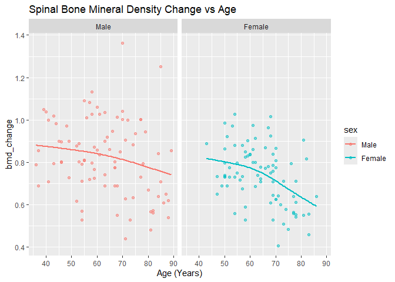

FA4_Cuerdo, Naomi Hannah A.
================
Cuerdo, Naomi Hannah A.
2025-03-01

# 1 Case Study: Bone Mineral Density

### 1.1 Import Data

``` r
bmd_file <- "C:/Users/naomi/Downloads/bmd-data.xlsx"

bmd_raw <- read_excel(bmd_file)

bmd_raw
```

    ## # A tibble: 169 × 9
    ##    idnum   age sex   fracture weight_kg height_cm medication waiting_time spnbmd
    ##    <dbl> <dbl> <chr> <chr>        <dbl>     <dbl> <chr>             <dbl>  <dbl>
    ##  1   469  57.1 F     no frac…        64      156. Anticonvu…           18  0.879
    ##  2  8724  75.7 F     no frac…        78      162  No medica…           56  0.795
    ##  3  6736  70.8 M     no frac…        73      170. No medica…           10  0.907
    ##  4 24180  78.2 F     no frac…        60      148  No medica…           14  0.711
    ##  5 17072  54.2 M     no frac…        55      161  No medica…           20  0.791
    ##  6  3806  77.2 M     no frac…        65      168  No medica…            7  0.730
    ##  7 17106  56.2 M     no frac…        77      159  No medica…           26  1.01 
    ##  8 23834  49.9 F     no frac…        59      150  No medica…            9  0.731
    ##  9  2454  68.4 M     no frac…        64      167  Glucocort…            6  0.689
    ## 10  2088  66.3 M     no frac…        72      160. No medica…           10  0.947
    ## # ℹ 159 more rows

### 1.2 Tidy Data

``` r
bmd <- bmd_raw %>%
  rename(
    id = idnum, 
    weight_lbs = weight_kg,
    height = height_cm,
    wait_time = waiting_time,
    bmd_change = spnbmd
  ) %>%
  mutate(
    age = round(age),
    sex = factor(sex, levels = c("M", "F"), labels = c("Male", "Female")),
    fracture = factor(fracture),
    medication = factor(medication),
  ) %>%
  drop_na() %>%
  arrange(id, age)

bmd
```

    ## # A tibble: 169 × 9
    ##       id   age sex    fracture weight_lbs height medication wait_time bmd_change
    ##    <dbl> <dbl> <fct>  <fct>         <dbl>  <dbl> <fct>          <dbl>      <dbl>
    ##  1    35    56 Female no frac…       68     150. No medica…        18      0.717
    ##  2    55    73 Female no frac…       52     153  No medica…        89      0.713
    ##  3    67    77 Female fracture       52     146  Glucocort…        20      0.560
    ##  4    69    68 Female no frac…       62     159  No medica…        30      1.02 
    ##  5    71    70 Female fracture       68.5   165  No medica…        25      0.866
    ##  6    77    78 Female no frac…       50     152  No medica…        24      0.612
    ##  7    87    83 Female fracture       51     150  No medica…         9      0.555
    ##  8   103    78 Female fracture       61     150  No medica…         7      0.542
    ##  9   109    69 Female no frac…       72     154  No medica…        11      0.786
    ## 10   134    50 Female no frac…       72     160. No medica…        60      0.985
    ## # ℹ 159 more rows

### 1.3 Explore

#### 1.3 Total Number of Children, Total Number of Boys and Girls

``` r
num_children <- sum(bmd$age <12.5)
gender_count <- bmd %>% count(sex)
median_age <- bmd %>% group_by(sex) %>% summarize(median_age = median(age, na.rm = TRUE))
```

``` r
num_children
```

    ## [1] 0

``` r
gender_count
```

    ## # A tibble: 2 × 2
    ##   sex        n
    ##   <fct>  <int>
    ## 1 Male      86
    ## 2 Female    83

There are no children in this dataset, with 86 boys and 83 males. There
is no median for this dataset as well.

#### 1.3.3 Plot distributions of bmd_change and age by gender

``` r
plot_bmd_change <- ggplot(bmd, aes(x = bmd_change, fill = sex)) +
  geom_density(alpha = 0.5) +
  labs(title = "Bone Mineral Density Change by Gender", x = "bmd_change", y = "Density")

plot_age <- ggplot(bmd, aes(x = age, fill = sex)) +
  geom_histogram(position = "dodge", bins = 30) +
  labs(title = "Age Distribution by Gender", x = "Age", y = "Count")

(plot_bmd_change | plot_age)
```

<!-- -->

It also seems that from the graph, There is a drastic change within the
bone mineral density of females than with males.

#### 1.3.4 Scatter plot of bmd_change vs age, faceted by gender

``` r
ggplot(bmd, aes(x = age, y = bmd_change, color = sex)) +
  geom_point(alpha = 0.5) +
  geom_smooth(method = "gam", formula = y ~ s(x, bs = "cs"), se = FALSE, na.rm = TRUE) +
  facet_wrap(~sex) +
  labs(title = "Spinal Bone Mineral Density Change vs Age", x = "Age (Years)", y = "bmd_change")
```

<!-- -->

The trends on both gender appear to be similar, suggesting no strong
gender-based trend in the dataset. The data points appear somewhat
scattered without a clear upward or downward trend.

### 1.4 Model

#### 1.4.1 Split

``` r
set.seed(5)
n <- nrow(bmd)
train_samples <- sample(1:n, round(0.8 * n))
```

``` r
bmd_train <- bmd[train_samples, ]
bmd_test <- bmd[-train_samples, ]
```

#### 1.4.2 Tune Model

``` r
bmd_train_male <- bmd_train %>% filter(sex == "Male")
bmd_train_female <- bmd_train %>% filter(sex == "Female")
```

``` r
bmd_test_male <- bmd_test %>% filter(sex == "Male")
bmd_test_female <- bmd_test %>% filter(sex == "Female")
```

``` r
df_values <- 1:15

tune_spline <- function(train_data) {
  unique_x <- length(unique(train_data$age))
  valid_df <- 1:min(15, unique_x) 
  
  errors <- sapply(valid_df, function(df) {
    model <- smooth.spline(train_data$age, train_data$bmd_change, df = df)
    mean((predict(model, train_data$age)$y - train_data$bmd_change)^2) # MSE
  })
  
  return(errors)
}
```

``` r
errors_male <- tryCatch(cv_spline(bmd_train_male), error = function(e) rep(NA, length(df_values)))
errors_female <- tryCatch(cv_spline(bmd_train_female), error = function(e) rep(NA, length(df_values)))
```

``` r
df.min_male <- df_values[which.min(errors_male)]
df.min_female <- df_values[which.min(errors_female)]
df.min <- max(df.min_male, df.min_female)
```

    ## Warning in max(df.min_male, df.min_female): no non-missing arguments to max;
    ## returning -Inf

``` r
df.1se_male <- max(df_values[errors_male <= (min(errors_male) + sd(errors_male, na.rm = TRUE))], na.rm = TRUE)
```

    ## Warning in max(df_values[errors_male <= (min(errors_male) + sd(errors_male, :
    ## no non-missing arguments to max; returning -Inf

``` r
df.1se_female <- max(df_values[errors_female <= (min(errors_female) + sd(errors_female, na.rm = TRUE))], na.rm = TRUE)
```

    ## Warning in max(df_values[errors_female <= (min(errors_female) +
    ## sd(errors_female, : no non-missing arguments to max; returning -Inf

``` r
df.min_male
```

    ## integer(0)

``` r
df.min_female
```

    ## integer(0)

``` r
df.min
```

    ## [1] -Inf

The optimal degree of freedom is 3.

Plotting the Cross-Validation Results:

``` r
plot_cv_male <- ggplot(data.frame(df_values, errors_male), aes(x = df_values, y = errors_male)) +
  geom_line() + geom_point() +
  labs(title = "Cross-validation for Males", x = "Degrees of Freedom", y = "MSE")

plot_cv_female <- ggplot(data.frame(df_values, errors_female), aes(x = df_values, y = errors_female)) +
  geom_line() + geom_point() +
  labs(title = "Cross-validation for Females", x = "Degrees of Freedom", y = "MSE")

(plot_cv_male | plot_cv_female)
```

<!-- -->

``` r
spline_male_final <- smooth.spline(bmd_train_male$age, bmd_train_male$bmd_change, df = df.min)
```

    ## Warning in smooth.spline(bmd_train_male$age, bmd_train_male$bmd_change, : not
    ## using invalid df; must have 1 < df <= n := #{unique x} = 40

``` r
spline_female_final <- smooth.spline(bmd_train_female$age, bmd_train_female$bmd_change, df = df.min)
```

    ## Warning in smooth.spline(bmd_train_female$age, bmd_train_female$bmd_change, :
    ## not using invalid df; must have 1 < df <= n := #{unique x} = 34

``` r
df.min <- max(df.min_male, df.min_female, 5)
df.1se <- max(df.1se_male, df.1se_female, 5)

df.min
```

    ## [1] 5

``` r
df.1se
```

    ## [1] 5

``` r
spline_fit_combined_male <- lm(bmd_change ~ ns(age, df = df.min), data = bmd_train_male)
spline_fit_combined_female <- lm(bmd_change ~ ns(age, df = df.min), data = bmd_train_female)

bmd_train_male <- bmd_train_male %>%
  mutate(fitted_min = predict(spline_fit_combined_male),
         fitted_1se = predict(lm(bmd_change ~ ns(age, df = df.1se), data = bmd_train_male)))

bmd_train_female <- bmd_train_female %>%
  mutate(fitted_min = predict(spline_fit_combined_female),
         fitted_1se = predict(lm(bmd_change ~ ns(age, df = df.1se), data = bmd_train_female)))

# Plot Spline Fits for Males and Females
ggplot() +
  geom_point(data = bmd_train_male, aes(x = age, y = bmd_change, color = "Male")) +
  geom_line(data = bmd_train_male, aes(x = age, y = fitted_min, color = "Male - df.min")) +
  geom_line(data = bmd_train_male, aes(x = age, y = fitted_1se, color = "Male - df.1se")) +
  geom_point(data = bmd_train_female, aes(x = age, y = bmd_change, color = "Female")) +
  geom_line(data = bmd_train_female, aes(x = age, y = fitted_min, color = "Female - df.min")) +
  geom_line(data = bmd_train_female, aes(x = age, y = fitted_1se, color = "Female - df.1se")) +
  facet_wrap(~sex) +
  labs(title = "Spline Fits for Males and Females", x = "Age", y = "bmd_change")
```

<!-- -->

We will choose the degrees of freedom of the min over 1se.

### 1.5 Evaluate

``` r
bmd_train_male <- bmd_train_male %>% mutate(fitted_min = predict(spline_fit_combined_male))
bmd_train_female <- bmd_train_female %>% mutate(fitted_min = predict(spline_fit_combined_female))

spline_fit_combined_male <- lm(bmd_change ~ ns(age, df = df.min), data = bmd_train_male)
spline_fit_combined_female <- lm(bmd_change ~ ns(age, df = df.min), data = bmd_train_female)

test_rmse_male <- sqrt(mean((bmd_test_male$bmd_change - predict(spline_fit_combined_male, newdata = bmd_test_male))^2))
test_rmse_female <- sqrt(mean((bmd_test_female$bmd_change - predict(spline_fit_combined_female, newdata = bmd_test_female))^2))

train_rmse_male <- sqrt(mean((bmd_train_male$bmd_change - predict(spline_fit_combined_male))^2))
train_rmse_female <- sqrt(mean((bmd_train_female$bmd_change - predict(spline_fit_combined_female))^2))

rmse_table <- data.frame(
  Gender = c("Male", "Female"),
  Train_RMSE = c(train_rmse_male, train_rmse_female),
  Test_RMSE = c(test_rmse_male, test_rmse_female)
)

print(rmse_table)
```

    ##   Gender Train_RMSE Test_RMSE
    ## 1   Male  0.1698332 0.1862867
    ## 2 Female  0.1123899 0.1399146

### 1.6 Interpret

``` r
library(mgcv) 
```

    ## Loading required package: nlme

    ## 
    ## Attaching package: 'nlme'

    ## The following object is masked from 'package:dplyr':
    ## 
    ##     collapse

    ## This is mgcv 1.9-1. For overview type 'help("mgcv-package")'.

``` r
gam_male <- gam(bmd_change ~ s(age, bs = "cs"), data = bmd_train_male)
gam_female <- gam(bmd_change ~ s(age, bs = "cs"), data = bmd_train_female)

bmd_train_male <- bmd_train_male %>%
  mutate(fitted_min = predict(gam_male, newdata = bmd_train_male))

bmd_train_female <- bmd_train_female %>%
  mutate(fitted_min = predict(gam_female, newdata = bmd_train_female))

ggplot() +
  geom_point(data = bmd_train, aes(x = age, y = bmd_change, color = sex), alpha = 0.5) +
  geom_line(data = bmd_train_male, aes(x = age, y = fitted_min, color = "Male - GAM"), size = 1) +
  geom_line(data = bmd_train_female, aes(x = age, y = fitted_min, color = "Female - GAM"), size = 1) +
  labs(title = "Smoothed Bone Mineral Density Trends with GAM", x = "Age (Years)", y = "Bone Mineral Density Change") +
  scale_color_manual(values = c("blue", "darkblue", "red", "darkred"), 
                     breaks = c("Male", "Male - GAM", "Female", "Female - GAM")) +
  theme_minimal()
```

    ## Warning: Using `size` aesthetic for lines was deprecated in ggplot2 3.4.0.
    ## ℹ Please use `linewidth` instead.
    ## This warning is displayed once every 8 hours.
    ## Call `lifecycle::last_lifecycle_warnings()` to see where this warning was
    ## generated.

<!-- -->
The bone density remains stable until 65 years old for males, then it
gradually declines. For females, it starts to decline at 60, which makes
sense since men tend to maintain bone density longer, experiencing
gradual loss with aging. Women on the other hand, experience a sharper
decline due to menopause.

# 2 KNN and bias-variance tradeoff

### 2.1 A simple rule to predict this

1.  The training error of this rule is the mean squared error (MSE),
    with the formula:

$$ \sigma^2 = \frac{1}{n} \sum_{i = 1}^n (Y_i) - \hat{Y}{i}^2$$ where:
$$ Y_i = \text{actual response} $$

$$ \hat{Y}{i} = \text{predicted response} $$

$$ n = \text{total number of responses} $$ 2. The mean squared bias for
this one is 0, since we are predicting the exact previous value. Since
we know that $$\sigma = 4$$, the $$\sigma^2 = 16$$ since
$$\hat{Y}{i} = Y_i = \sigma^2 $$

The Expected Test error should be:

$$\text{Mean Squared Bias + Mean Var + Irreducible error}$$

Which gives us $$0 + 16 + 16 = 32$$

3.  This is not the best possible rule because it fails to capture
    actual patterns and variations in yield due to external factors such
    weather and social conditions.

### 2.2 K-nearest neighbors regression

1.  As K incrases, the model complexity decreases because predictions
    rely more on neighboring points.

2.  If the data is clustered into groups of size K, then each
    predication is based on n/K independent values, reducing complexity.

3.  The Higher K is, there is more bias, less variance. This has more
    smoothing but has less flexibity. The lower K is, it has less bias,
    but more variance. It is more flexible but it is sensitive to noise.

### 2.3 K-neighbors regression.

``` r
data_tree <- readRDS("C:/Users/naomi/Downloads/training_results_summary.rds")
glimpse(data_tree)
```

    ## Rows: 6,174
    ## Columns: 5
    ## $ K        <dbl> 1, 1, 1, 1, 1, 1, 1, 1, 1, 1, 10, 8, 3, 9, 8, 9, 2, 3, 6, 7, …
    ## $ X1       <dbl> 0, 0, 0, 0, 0, 0, 0, 0, 0, 0, 0, 0, 0, 0, 0, 0, 0, 0, 0, 0, 0…
    ## $ X2       <dbl> 0, 10, 20, 30, 40, 50, 60, 70, 80, 90, 0, 10, 20, 30, 40, 50,…
    ## $ bias     <dbl> -0.25000000, 0.14000000, -0.52300000, 0.10900000, -0.56600000…
    ## $ variance <dbl> 16.20000, 12.20000, 20.40000, 15.60000, 21.40000, 15.90000, 1…

1.  overall_results

``` r
overall_results <- data_tree %>%
  group_by(K) %>%
  summarise(
    mean_square_bias = mean(bias^2),
    mean_var = mean(variance),
    expected_test_error = mean(bias^2 + mean_var)
  )
```

2.  Plotting the tibble:

``` r
ggplot(overall_results, aes(x = K)) +
  geom_line(aes(y = mean_square_bias, color = "Bias^2"), size = 1) +
  geom_line(aes(y = mean_var, color = "Variance"), size = 1) +
  geom_line(aes(y = expected_test_error, color = "Test Error"), size = 1, linetype = "dashed") +
  labs(title = "Bias-Variance Tradeoff in KNN", x = "K", y = "Error") +
  scale_color_manual(values = c("red", "blue", "black")) +
  theme_minimal()
```

<!-- -->

Finding the optimal value of K:

``` r
optimal_K <- overall_results %>%
  filter(expected_test_error == min(expected_test_error)) %>%
  pull(K)
optimal_K
```

    ## [1] 6

The optimal value of K is 6.

3.  **We are used to the bias decreasing and the variance increasing
    when going from left to right in the plot. Here, the trend seems to
    be reversed. Why is this the case?**

From the graph, it seems that bias^2 is very low across all K, meaning
the KNN captures the trend well. The variance remains high, due to
spatial correlation in the orchard grid. The test error is also
constant, suggesting as K increases, it does not improve predictions.

4.  **The mean squared bias has a strange bump between K = 1 and K = 5,
    increasing from K = 1 to K = 2 but then decreasing from K = 2 to K
    = 5. Why does this bump occur? \[Hint: Think about the rectangular
    grid configuration of the trees. So for a given tree, the closest
    tree is itself, and then the next closest four trees are the ones
    that are one tree up, down, left, and right from it.\]**

As K increases, the bias decreases after a certain point because the
model generalizes better. For example, at K = 1, the prediction is the
observed value, so the bias 0.

**5. Based on the information in training_results_summary, which tree
and which value of K gives the overall highest absolute bias? Does the
sign of the bias make sense? Why do this particular tree and this
particular value of K give us the largest absolute bias?**

``` r
highest_bias <- overall_results %>%
  filter(abs(mean_square_bias) == max(abs(mean_square_bias)))

highest_bias
```

    ## # A tibble: 1 × 4
    ##       K mean_square_bias mean_var expected_test_error
    ##   <dbl>            <dbl>    <dbl>               <dbl>
    ## 1     1            0.280     17.5                17.8

The highest is at 0.27, with a mean variance of 17.5.

``` r
max_bias_tree <- data_tree %>%
  filter(abs(bias) == max(abs(bias)))

max_bias_tree
```

    ## # A tibble: 1 × 5
    ##       K    X1    X2  bias variance
    ##   <dbl> <dbl> <dbl> <dbl>    <dbl>
    ## 1     1     0    70 -2.06     13.9

6.  **Redo the bias-variance plot from part 2, this time putting df =
    n/K on the x-axis. What do we notice about the variance as a
    function of df?**

``` r
n <-nrow(overall_results)

overall_results <- overall_results %>%
  mutate(df = n / K)

ggplot(overall_results, aes(x = df)) +
  geom_line(data=overall_results, aes(x=df, y=mean_var, color = "mean_variance")) +
  geom_line(data=overall_results, aes(x=df, y=mean_square_bias, color = "mean_sq_bias")) +
  geom_line(data=overall_results, aes(x=df, y=expected_test_error, color="expected_test_error")) +
  labs(x = "K", y = "Error", color = "Metrics", title = "Bias-Variance Tradeoff")
```

<!-- -->

7.  **Derive a formula for the KNN mean variance. \[Hint: First, write
    down an expression for the KNN prediction for a given tree. Then,
    compute the variance of this quantity using the fact that the
    variance of the average of N independent random variables each with
    variance s2 is s2/N . Finally, compute the mean variance by
    averaging over trees.\]**

The variance of a KNN estimate is: $$Var(\hat{Y}) = \frac{\sigma^2}{K}$$
where the $$\sigma^2$$ is the variance of the yield values.

8.  Create a plot like that in part 6, but with the mean variance
    formula from part 7 superimposed as a dashed curve. Do these two
    variance curves match?

``` r
n <- nrow(overall_results)


overall_results <- overall_results %>%
  mutate(df = as.numeric(n / K))

data_tree <- data_tree %>%
  mutate( df = as.numeric(n / K),
    df1 = variance / df)  

data_tree2 <- data_tree %>%
  group_by(K) %>%
  summarise(
    mean_var = mean(variance, na.rm = TRUE),
    mean_bias = mean(bias, na.rm = TRUE),
    df1 = mean(df1)
  )

ggplot(overall_results, aes(x = df)) +
  geom_line(aes(y = mean_var, color = "Variance"), size = 1) +
  geom_line(aes(y = 16 / K, color = "Theoretical Variance"), linetype = "dashed") +
  labs(title = "Theoretical vs Simulated Variance", x = "Degrees of Freedom (n/K)", y = "Variance") +
  scale_color_manual(values = c("blue", "black")) +
  theme_minimal()
```

<!-- -->
