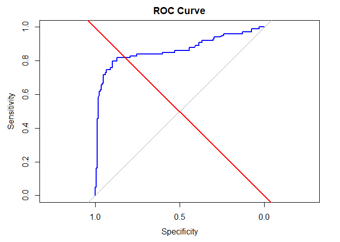

FA 5
================
Cuerdo, Naomi Hannah A.
2025-04-30

# Classification via Logistic Regression

#### Introduction

This report aims to predic passenger survival on the Titanic using a
logistic regression model. The analysis is based on the Titanic dataset,
which contains information about passengers such as age, sex, class,
fare, and deck. The objective is to build a classification model that
can accurately predicted whether a passenger survived, and to evaluate
the model’s performance using metrics such as accuracy, precision,
recall, F1-score, and AUC.

#### Data Preprocessing

``` r
titanic_train <- read.csv("C:/Users/naomi/Downloads/train.csv")
titanic_test <- read.csv("C:/Users/naomi/Downloads/test.csv")
gender_titanic <- read.csv("C:/Users/naomi/Downloads/gender_submission.csv")

head(titanic_train)
```

    ##   PassengerId Survived Pclass
    ## 1           1        0      3
    ## 2           2        1      1
    ## 3           3        1      3
    ## 4           4        1      1
    ## 5           5        0      3
    ## 6           6        0      3
    ##                                                  Name    Sex Age SibSp Parch
    ## 1                             Braund, Mr. Owen Harris   male  22     1     0
    ## 2 Cumings, Mrs. John Bradley (Florence Briggs Thayer) female  38     1     0
    ## 3                              Heikkinen, Miss. Laina female  26     0     0
    ## 4        Futrelle, Mrs. Jacques Heath (Lily May Peel) female  35     1     0
    ## 5                            Allen, Mr. William Henry   male  35     0     0
    ## 6                                    Moran, Mr. James   male  NA     0     0
    ##             Ticket    Fare Cabin Embarked
    ## 1        A/5 21171  7.2500              S
    ## 2         PC 17599 71.2833   C85        C
    ## 3 STON/O2. 3101282  7.9250              S
    ## 4           113803 53.1000  C123        S
    ## 5           373450  8.0500              S
    ## 6           330877  8.4583              Q

``` r
head(titanic_test)
```

    ##   PassengerId Pclass                                         Name    Sex  Age
    ## 1         892      3                             Kelly, Mr. James   male 34.5
    ## 2         893      3             Wilkes, Mrs. James (Ellen Needs) female 47.0
    ## 3         894      2                    Myles, Mr. Thomas Francis   male 62.0
    ## 4         895      3                             Wirz, Mr. Albert   male 27.0
    ## 5         896      3 Hirvonen, Mrs. Alexander (Helga E Lindqvist) female 22.0
    ## 6         897      3                   Svensson, Mr. Johan Cervin   male 14.0
    ##   SibSp Parch  Ticket    Fare Cabin Embarked
    ## 1     0     0  330911  7.8292              Q
    ## 2     1     0  363272  7.0000              S
    ## 3     0     0  240276  9.6875              Q
    ## 4     0     0  315154  8.6625              S
    ## 5     1     1 3101298 12.2875              S
    ## 6     0     0    7538  9.2250              S

``` r
head(gender_titanic)
```

    ##   PassengerId Survived
    ## 1         892        0
    ## 2         893        1
    ## 3         894        0
    ## 4         895        0
    ## 5         896        1
    ## 6         897        0

``` r
titanic_test <- merge(titanic_test, gender_titanic, by = "PassengerId")

titanic_train <- titanic_train[, colnames(titanic_test)]

titanic_full <- rbind(titanic_train, titanic_test)
```

``` r
colSums(is.na(titanic_full))
```

    ## PassengerId      Pclass        Name         Sex         Age       SibSp 
    ##           0           0           0           0         263           0 
    ##       Parch      Ticket        Fare       Cabin    Embarked    Survived 
    ##           0           0           1           0           0           0

From the columns, there 263 NAs in Age and 1 NA in Fare. Since there are
a lot of null values in Age, we will fill this in with the median of the
entire dataset.

Moreover, since there is only 1 null value in Fare, this can be removed.

``` r
titanic_full$Age[is.na(titanic_full$Age)] <- median(titanic_full$Age, na.rm = TRUE)

titanic_full <- titanic_full[!is.na(titanic_full$Fare), ]
colSums(is.na(titanic_full))
```

    ## PassengerId      Pclass        Name         Sex         Age       SibSp 
    ##           0           0           0           0           0           0 
    ##       Parch      Ticket        Fare       Cabin    Embarked    Survived 
    ##           0           0           0           0           0           0

We have now removed all null values in the entire column.

Although it is not seen in the colSums, the Cabin column has a blank
cabin for passengers, thus we shall use “U” as unknown for the missing
values. We will also remove the number and keep the letter as the letter
indicates the deck level.

``` r
titanic_full$Cabin[is.na(titanic_full$Cabin)] <- "U"
titanic_full$Deck <- substr(titanic_full$Cabin, 1, 1)
```

checking the dataset again,

``` r
str(titanic_full)
```

    ## 'data.frame':    1308 obs. of  13 variables:
    ##  $ PassengerId: int  1 2 3 4 5 6 7 8 9 10 ...
    ##  $ Pclass     : int  3 1 3 1 3 3 1 3 3 2 ...
    ##  $ Name       : chr  "Braund, Mr. Owen Harris" "Cumings, Mrs. John Bradley (Florence Briggs Thayer)" "Heikkinen, Miss. Laina" "Futrelle, Mrs. Jacques Heath (Lily May Peel)" ...
    ##  $ Sex        : chr  "male" "female" "female" "female" ...
    ##  $ Age        : num  22 38 26 35 35 28 54 2 27 14 ...
    ##  $ SibSp      : int  1 1 0 1 0 0 0 3 0 1 ...
    ##  $ Parch      : int  0 0 0 0 0 0 0 1 2 0 ...
    ##  $ Ticket     : chr  "A/5 21171" "PC 17599" "STON/O2. 3101282" "113803" ...
    ##  $ Fare       : num  7.25 71.28 7.92 53.1 8.05 ...
    ##  $ Cabin      : chr  "" "C85" "" "C123" ...
    ##  $ Embarked   : chr  "S" "C" "S" "S" ...
    ##  $ Survived   : int  0 1 1 1 0 0 0 0 1 1 ...
    ##  $ Deck       : chr  "" "C" "" "C" ...

Changing the Sex variable to a numerical feature:

``` r
titanic_full$Sex <- as.character(titanic_full$Sex)

titanic_full$Sex <- ifelse(titanic_full$Sex == "male", 1, 0)

str(titanic_full)
```

    ## 'data.frame':    1308 obs. of  13 variables:
    ##  $ PassengerId: int  1 2 3 4 5 6 7 8 9 10 ...
    ##  $ Pclass     : int  3 1 3 1 3 3 1 3 3 2 ...
    ##  $ Name       : chr  "Braund, Mr. Owen Harris" "Cumings, Mrs. John Bradley (Florence Briggs Thayer)" "Heikkinen, Miss. Laina" "Futrelle, Mrs. Jacques Heath (Lily May Peel)" ...
    ##  $ Sex        : num  1 0 0 0 1 1 1 1 0 0 ...
    ##  $ Age        : num  22 38 26 35 35 28 54 2 27 14 ...
    ##  $ SibSp      : int  1 1 0 1 0 0 0 3 0 1 ...
    ##  $ Parch      : int  0 0 0 0 0 0 0 1 2 0 ...
    ##  $ Ticket     : chr  "A/5 21171" "PC 17599" "STON/O2. 3101282" "113803" ...
    ##  $ Fare       : num  7.25 71.28 7.92 53.1 8.05 ...
    ##  $ Cabin      : chr  "" "C85" "" "C123" ...
    ##  $ Embarked   : chr  "S" "C" "S" "S" ...
    ##  $ Survived   : int  0 1 1 1 0 0 0 0 1 1 ...
    ##  $ Deck       : chr  "" "C" "" "C" ...

Standardizing the numerical features so that the big numbers do not
dominate the model:

``` r
titanic_full$Age <- scale(titanic_full$Age)
titanic_full$Fare <- scale(titanic_full$Fare)
titanic_full$SibSp <- scale(titanic_full$SibSp)
titanic_full$Parch <- scale(titanic_full$Parch)

str(titanic_full)
```

    ## 'data.frame':    1308 obs. of  13 variables:
    ##  $ PassengerId: int  1 2 3 4 5 6 7 8 9 10 ...
    ##  $ Pclass     : int  3 1 3 1 3 3 1 3 3 2 ...
    ##  $ Name       : chr  "Braund, Mr. Owen Harris" "Cumings, Mrs. John Bradley (Florence Briggs Thayer)" "Heikkinen, Miss. Laina" "Futrelle, Mrs. Jacques Heath (Lily May Peel)" ...
    ##  $ Sex        : num  1 0 0 0 1 1 1 1 0 0 ...
    ##  $ Age        : num [1:1308, 1] -0.581 0.661 -0.27 0.429 0.429 ...
    ##   ..- attr(*, "scaled:center")= num 29.5
    ##   ..- attr(*, "scaled:scale")= num 12.9
    ##  $ SibSp      : num [1:1308, 1] 0.481 0.481 -0.479 0.481 -0.479 ...
    ##   ..- attr(*, "scaled:center")= num 0.499
    ##   ..- attr(*, "scaled:scale")= num 1.04
    ##  $ Parch      : num [1:1308, 1] -0.445 -0.445 -0.445 -0.445 -0.445 ...
    ##   ..- attr(*, "scaled:center")= num 0.385
    ##   ..- attr(*, "scaled:scale")= num 0.866
    ##  $ Ticket     : chr  "A/5 21171" "PC 17599" "STON/O2. 3101282" "113803" ...
    ##  $ Fare       : num [1:1308, 1] -0.503 0.734 -0.49 0.383 -0.488 ...
    ##   ..- attr(*, "scaled:center")= num 33.3
    ##   ..- attr(*, "scaled:scale")= num 51.8
    ##  $ Cabin      : chr  "" "C85" "" "C123" ...
    ##  $ Embarked   : chr  "S" "C" "S" "S" ...
    ##  $ Survived   : int  0 1 1 1 0 0 0 0 1 1 ...
    ##  $ Deck       : chr  "" "C" "" "C" ...

Splitting the dataset into training and testing set again:

``` r
set.seed(421)

split <- initial_split(titanic_full, prop = 0.8, strata = "Survived")

titanic_train <- training(split)
titanic_test <- testing(split)
```

#### Model Implementation

Implementing logisitic regression:

``` r
log_model_titanic <- glm(Survived ~ Pclass + Sex + Age + SibSp + Parch + Fare + Deck + Embarked, data = titanic_train, family = binomial)

summary(log_model_titanic)
```

    ## 
    ## Call:
    ## glm(formula = Survived ~ Pclass + Sex + Age + SibSp + Parch + 
    ##     Fare + Deck + Embarked, family = binomial, data = titanic_train)
    ## 
    ## Coefficients:
    ##              Estimate Std. Error z value Pr(>|z|)    
    ## (Intercept)  14.95990  617.82995   0.024 0.980682    
    ## Pclass       -0.83390    0.18745  -4.449 8.64e-06 ***
    ## Sex          -3.92164    0.22597 -17.354  < 2e-16 ***
    ## Age          -0.36800    0.10535  -3.493 0.000477 ***
    ## SibSp        -0.32465    0.10637  -3.052 0.002272 ** 
    ## Parch        -0.13926    0.09257  -1.504 0.132479    
    ## Fare          0.15430    0.12421   1.242 0.214127    
    ## DeckA         1.01750    0.60153   1.692 0.090739 .  
    ## DeckB         0.70667    0.52219   1.353 0.175966    
    ## DeckC         0.28538    0.45481   0.627 0.530346    
    ## DeckD         0.73431    0.52165   1.408 0.159231    
    ## DeckE         1.76442    0.52477   3.362 0.000773 ***
    ## DeckF         1.07249    0.72313   1.483 0.138039    
    ## DeckG        -2.01273    1.27109  -1.583 0.113314    
    ## DeckT       -13.04986  882.74343  -0.015 0.988205    
    ## EmbarkedC   -11.56912  617.82981  -0.019 0.985060    
    ## EmbarkedQ   -11.13710  617.82987  -0.018 0.985618    
    ## EmbarkedS   -11.50129  617.82980  -0.019 0.985148    
    ## ---
    ## Signif. codes:  0 '***' 0.001 '**' 0.01 '*' 0.05 '.' 0.1 ' ' 1
    ## 
    ## (Dispersion parameter for binomial family taken to be 1)
    ## 
    ##     Null deviance: 1386.77  on 1045  degrees of freedom
    ## Residual deviance:  740.94  on 1028  degrees of freedom
    ## AIC: 776.94
    ## 
    ## Number of Fisher Scoring iterations: 13

With the summary above, we can say that sex is significant, which
implies that the sex of the person is important in surviving. Moreover,
Age and SibSp are also significant, meaning younger people have a higher
chance to survive. Deck E and A are also significant. The other
variables are insignificant or less likely to affect their chance of
surviving the catastrophe.

Predicting the test set:

``` r
test_pred_prob <- predict(log_model_titanic, newdata = titanic_test, test = "response")
test_pred_class <- ifelse(test_pred_prob > 0.5, 1, 0)

test_pred_class
```

    ##   1   2   3   4   5   6   7   8   9  10  11  12  13  14  15  16  17  18  19  20 
    ##   1   1   0   0   0   0   0   1   1   0   0   0   0   0   1   0   1   0   0   0 
    ##  21  22  23  24  25  26  27  28  29  30  31  32  33  34  35  36  37  38  39  40 
    ##   0   0   0   0   0   0   0   0   0   0   0   0   1   0   1   0   0   1   0   0 
    ##  41  42  43  44  45  46  47  48  49  50  51  52  53  54  55  56  57  58  59  60 
    ##   0   0   0   0   1   0   0   0   0   0   0   0   0   1   0   0   1   1   1   0 
    ##  61  62  63  64  65  66  67  68  69  70  71  72  73  74  75  76  77  78  79  80 
    ##   0   0   0   0   0   0   0   1   1   0   0   0   1   1   1   1   0   0   1   1 
    ##  81  82  83  84  85  86  87  88  89  90  91  92  93  94  95  96  97  98  99 100 
    ##   0   0   1   0   1   1   1   0   0   1   1   1   0   0   0   0   0   0   0   1 
    ## 101 102 103 104 105 106 107 108 109 110 111 112 113 114 115 116 117 118 119 120 
    ##   1   1   0   1   0   1   1   0   1   0   0   0   0   0   0   0   0   0   0   0 
    ## 121 122 123 124 125 126 127 128 129 130 131 132 133 134 135 136 137 138 139 140 
    ##   1   0   0   0   1   0   1   0   0   1   0   0   1   0   0   1   1   0   0   0 
    ## 141 142 143 144 145 146 147 148 149 150 151 152 153 154 155 156 157 158 159 160 
    ##   0   0   0   0   0   0   0   0   0   0   1   0   0   0   0   0   1   0   0   0 
    ## 161 162 163 164 165 166 167 168 169 170 171 172 173 174 175 176 177 178 179 180 
    ##   0   0   0   0   0   0   1   0   1   0   0   1   0   1   1   0   0   0   0   0 
    ## 181 182 183 184 185 186 187 188 189 190 191 192 193 194 195 196 197 198 199 200 
    ##   0   0   1   0   1   0   0   1   0   0   0   1   1   0   0   1   0   0   1   0 
    ## 201 202 203 204 205 206 207 208 209 210 211 212 213 214 215 216 217 218 219 220 
    ##   0   0   1   1   0   0   0   0   1   1   0   1   0   1   0   0   1   0   0   0 
    ## 221 222 223 224 225 226 227 228 229 230 231 232 233 234 235 236 237 238 239 240 
    ##   0   0   0   0   0   1   1   1   0   1   0   1   1   0   0   1   0   1   1   0 
    ## 241 242 243 244 245 246 247 248 249 250 251 252 253 254 255 256 257 258 259 260 
    ##   1   0   1   0   1   0   1   0   1   0   0   0   1   1   0   1   0   0   0   0 
    ## 261 262 
    ##   1   0

Counting the passengers who survived:

``` r
count_survivors <- (sum(test_pred_class)/262) * 100

count_survivors
```

    ## [1] 31.29771

31.3% of the passengers predicted in the test survived while the rest
did not.

#### Model Evaluation

Using performance metrics such as confusion matrix, roc curve, auc
score, accuracy, etc., We can check how the model performed and find
ways to have better evaluation.

``` r
log_perf <- confusionMatrix(factor(test_pred_class), factor(titanic_test$Survived))

log_perf
```

    ## Confusion Matrix and Statistics
    ## 
    ##           Reference
    ## Prediction   0   1
    ##          0 153  27
    ##          1  10  72
    ##                                           
    ##                Accuracy : 0.8588          
    ##                  95% CI : (0.8106, 0.8986)
    ##     No Information Rate : 0.6221          
    ##     P-Value [Acc > NIR] : < 2.2e-16       
    ##                                           
    ##                   Kappa : 0.6892          
    ##                                           
    ##  Mcnemar's Test P-Value : 0.008529        
    ##                                           
    ##             Sensitivity : 0.9387          
    ##             Specificity : 0.7273          
    ##          Pos Pred Value : 0.8500          
    ##          Neg Pred Value : 0.8780          
    ##              Prevalence : 0.6221          
    ##          Detection Rate : 0.5840          
    ##    Detection Prevalence : 0.6870          
    ##       Balanced Accuracy : 0.8330          
    ##                                           
    ##        'Positive' Class : 0               
    ## 

``` r
accuracy <- log_perf$overall["Accuracy"]
precision <- log_perf$byClass["Pos Pred Value"]
recall <- log_perf$byClass["Sensitivity"]

f1_score <- 2 * (precision * recall) / (precision + recall)

roc_curve <- roc(titanic_test$Survived, test_pred_prob)
```

    ## Setting levels: control = 0, case = 1

    ## Setting direction: controls < cases

``` r
auc_value <- auc(roc_curve)
cat("Model Performance Metrics:", auc_value )
```

    ## Model Performance Metrics: 0.862428

``` r
cat("\nPrecision: ", round(precision, 4), "\n")
```

    ## 
    ## Precision:  0.85

``` r
cat("Recall: ", round(recall, 4), "\n")
```

    ## Recall:  0.9387

``` r
cat("F1-Score: ", round(f1_score, 4), "\n")
```

    ## F1-Score:  0.8921

``` r
cat("AUC Score:", round(auc_value, 4), "\n")
```

    ## AUC Score: 0.8624

With this, we can now plot the ROC curve and the Confusion Matrix
Heatmap:

``` r
plot(roc_curve, col = "blue", main = "ROC Curve")
abline(a = 0, b = 1, col = "red", lwd = 2)
```

<!-- -->

``` r
cm_df <- as.data.frame(log_perf$table)
colnames(cm_df) <- c("Predicted", "Actual", "Freq")

ggplot(data = cm_df, aes(x = Actual, y = Predicted, fill = Freq)) +
  geom_tile(color = "white") +
  geom_text(aes(label = Freq), vjust = 1) +
  labs(title = "Confusion Matrix Heatmap", x = "Actual", y = "Predicted") +
  theme_minimal()
```

<!-- -->

With a performance of 86%, the model classified its passengers with the
given percentage, with an 85% of the predicted “survived” passengers.

The Recall also had a high percentage of 93.87%, which means that the
model catched the actual survivors, with an F1-score of 89.21%.

Given that the AUC score is at 86.24% and the ROC Curve going upwards
whilst staying on the lower end of specificity and higher sensitivity,
the model predicsts the true positive rate more rather than false
positive rate.

Lastly, the confusion matrix shows the true negatives, false negatives,
true positives, and false positives. As seen in the heat map, the model
predicted 153 true negatives and 72 true positives. the model also
predicted 10 false positives and 25 false negatives.

Overall, the model correctly predicted averaging around 80%-90%, having
a good performance all around.

#### Results Interpretation and Discussion:

Summary of the Model Findings:

Model Performance Metrics: 0.862428

Precision: 0.85

Recall: 0.9387

F1-Score: 0.8921

AUC Score: 0.8624

The logistic regression model achieved solid performance with over 86%
accuracy and an AUC of 0.8624, indicating a strong ability to
distinguish between survivors and non-survivors. The most influential
factors in predicting survival were passenger sex, age, and deck
assignment.

For future improvements:

Add interaction terms or polynomial features to capture non-linear
relationships.

Explore other classification algorithms like Random Forest or Gradient
Boosting.

Use cross-validation for more robust model validation.

Engineer additional features (e.g., family size, title from name).

Overall, the model performed well and provides valuable insights into
survival patterns aboard the Titanic.
