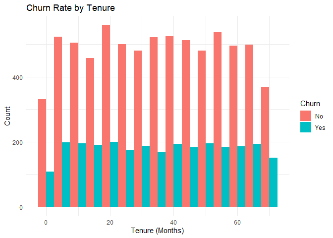
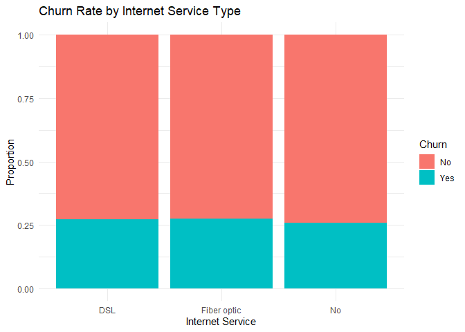
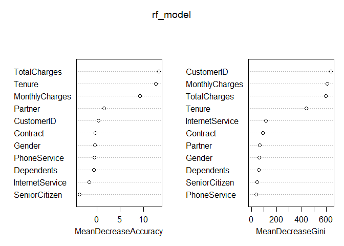
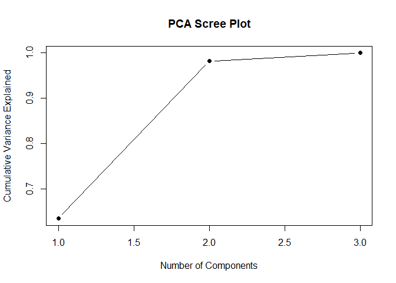

Summative Assessment 1
================
Cuerdo, Naomi Hannah A.
2025-03-15

#### Loading the dataset

``` r
df <- read.csv("C:/Users/naomi/Downloads/customer_churn.csv")
```

## 1 R for Data Mining

**1. Intro to Modern Data Mining**

``` r
dim(df)
```

    ## [1] 10000    12

``` r
str(df) 
```

    ## 'data.frame':    10000 obs. of  12 variables:
    ##  $ CustomerID     : chr  "CUST00001" "CUST00002" "CUST00003" "CUST00004" ...
    ##  $ Gender         : chr  "Male" "Male" "Male" "Female" ...
    ##  $ SeniorCitizen  : int  0 0 0 0 0 0 0 0 0 0 ...
    ##  $ Partner        : chr  "No" "No" "Yes" "Yes" ...
    ##  $ Dependents     : chr  "No" "No" "No" "Yes" ...
    ##  $ Tenure         : int  65 26 54 70 53 45 35 20 48 33 ...
    ##  $ PhoneService   : chr  "Yes" "Yes" "Yes" "Yes" ...
    ##  $ InternetService: chr  "Fiber optic" "Fiber optic" "Fiber optic" "DSL" ...
    ##  $ Contract       : chr  "Month-to-month" "Month-to-month" "Month-to-month" "One year" ...
    ##  $ MonthlyCharges : num  20 65.1 49.4 31.2 103.9 ...
    ##  $ TotalCharges   : num  1303 1694 2667 2183 5505 ...
    ##  $ Churn          : chr  "No" "No" "No" "No" ...

``` r
summary(df)
```

    ##   CustomerID           Gender          SeniorCitizen      Partner         
    ##  Length:10000       Length:10000       Min.   :0.0000   Length:10000      
    ##  Class :character   Class :character   1st Qu.:0.0000   Class :character  
    ##  Mode  :character   Mode  :character   Median :0.0000   Mode  :character  
    ##                                        Mean   :0.1502                     
    ##                                        3rd Qu.:0.0000                     
    ##                                        Max.   :1.0000                     
    ##   Dependents            Tenure      PhoneService       InternetService   
    ##  Length:10000       Min.   : 0.00   Length:10000       Length:10000      
    ##  Class :character   1st Qu.:17.00   Class :character   Class :character  
    ##  Mode  :character   Median :35.00   Mode  :character   Mode  :character  
    ##                     Mean   :35.22                                        
    ##                     3rd Qu.:53.00                                        
    ##                     Max.   :71.00                                        
    ##    Contract         MonthlyCharges    TotalCharges       Churn          
    ##  Length:10000       Min.   : 20.02   Min.   :   0.0   Length:10000      
    ##  Class :character   1st Qu.: 44.88   1st Qu.: 961.2   Class :character  
    ##  Mode  :character   Median : 70.56   Median :2025.6   Mode  :character  
    ##                     Mean   : 70.18   Mean   :2455.8                     
    ##                     3rd Qu.: 95.77   3rd Qu.:3611.0                     
    ##                     Max.   :119.99   Max.   :8425.6

``` r
sum(is.na(df))
```

    ## [1] 0

``` r
colnames(df)
```

    ##  [1] "CustomerID"      "Gender"          "SeniorCitizen"   "Partner"        
    ##  [5] "Dependents"      "Tenure"          "PhoneService"    "InternetService"
    ##  [9] "Contract"        "MonthlyCharges"  "TotalCharges"    "Churn"

**Dataset Overview:** - Dimensions: 10,000 rows x 12 columns - Missing
Values: None - Variable Types: Categorical: Gender, Partner, Dependents,
PhoneService, InternetService, Contract, Churn Numerical: Tenure,
MonthlyCharges, TotalCharges, SeniorCitizen (binary: 0 or 1) Identifier:
CustomerID

**Why Data Mining?**

We need to use data mining for this dataset because it identifies
patterns in customer churn, helps optimize customer retention
strategies, and it helps detect key factors influencing customer
behavior

## 2 Data Visualization

2.1 Churn Rate by Tenure

``` r
ggplot(df, aes(x = Tenure, fill = Churn)) +
  geom_histogram(binwidth = 5, position = "dodge") +
  labs(title = "Churn Rate by Tenure", x = "Tenure (Months)", y = "Count") +
  theme_minimal()
```

<!-- -->

2.2 Churn rate by Internet Service Type

``` r
ggplot(df, aes(x = InternetService, fill = Churn)) +
  geom_bar(position = "fill") +
  labs(title = "Churn Rate by Internet Service Type", x = "Internet Service", y = "Proportion") +
  theme_minimal()
```

<!-- -->

2.3 Monthly Charges vs Churn

``` r
ggplot(df, aes(x = MonthlyCharges, fill = Churn)) +
  geom_density(alpha = 0.5) +
  labs(title = "Distribution of Monthly Charges by Churn Status", x = "Monthly Charges", y = "Density") +
  theme_minimal()
```

<!-- -->

## 3 Data Transformation

``` r
df <- df %>%
  mutate(
    Gender = as.factor(Gender),
    SeniorCitizen = as.factor(SeniorCitizen),
    Partner = as.factor(Partner),
    Dependents = as.factor(Dependents),
    PhoneService = as.factor(PhoneService),
    InternetService = as.factor(InternetService),
    Contract = as.factor(Contract),
    Churn = as.factor(Churn) 
  )

df <- df %>%
  mutate(across(c(Gender, SeniorCitizen, Partner, Dependents, 
                  PhoneService, InternetService, Contract, Churn), as.factor))

df$MonthlyCharges <- as.numeric(df$MonthlyCharges)
df$TotalCharges <- as.numeric(df$TotalCharges)
```

## 4 Data Wrangling

``` r
Q1 <- quantile(df$TotalCharges, 0.25, na.rm = TRUE)
Q3 <- quantile(df$TotalCharges, 0.75, na.rm = TRUE)
IQR <- Q3 - Q1

lower_bound <- Q1 - 1.5 * IQR
upper_bound <- Q3 + 1.5 * IQR

df <- df %>%
  filter(TotalCharges >= as.numeric(lower_bound) & TotalCharges <= as.numeric(upper_bound))
```

## 5 Review

From the Exploratory Data Analysis, we can conclude that: 1. Short-
tenure customers churn more. 2. Certain service types have higher churn
rates. 3. Monthly charges may influence churn 4. Data Transformation
improved model readiness.

# 2 Tuning Predictive Models

## 6 Model Complexity

``` r
df$Churn <- factor(df$Churn, levels = c("No", "Yes"))

set.seed(42)
train_index <- createDataPartition(df$Churn, p = 0.8, list = FALSE)
train_data <- df[train_index, ]
test_data <- df[-train_index, ]

train_data$Churn <- factor(train_data$Churn, levels = c("No", "Yes"))
test_data$Churn <- factor(test_data$Churn, levels = c("No", "Yes"))

train_data$TotalCharges[is.na(train_data$TotalCharges)] <- median(train_data$TotalCharges, na.rm = TRUE)
```

``` r
log_model_churn <- glm(Churn ~ Tenure + MonthlyCharges + TotalCharges + Gender + Partner + Dependents + PhoneService + InternetService + Contract, data = train_data, family = binomial)

summary(log_model_churn)
```

    ## 
    ## Call:
    ## glm(formula = Churn ~ Tenure + MonthlyCharges + TotalCharges + 
    ##     Gender + Partner + Dependents + PhoneService + InternetService + 
    ##     Contract, family = binomial, data = train_data)
    ## 
    ## Coefficients:
    ##                              Estimate Std. Error z value Pr(>|z|)    
    ## (Intercept)                -8.832e-01  1.602e-01  -5.514  3.5e-08 ***
    ## Tenure                      2.799e-03  3.185e-03   0.879  0.37950    
    ## MonthlyCharges              8.265e-04  1.735e-03   0.476  0.63378    
    ## TotalCharges               -3.642e-05  4.284e-05  -0.850  0.39532    
    ## GenderMale                 -7.386e-02  5.063e-02  -1.459  0.14463    
    ## PartnerYes                 -1.061e-02  5.057e-02  -0.210  0.83381    
    ## DependentsYes              -4.815e-02  5.557e-02  -0.867  0.38621    
    ## PhoneServiceYes            -8.304e-02  8.410e-02  -0.987  0.32341    
    ## InternetServiceFiber optic  1.229e-03  5.628e-02   0.022  0.98258    
    ## InternetServiceNo          -7.418e-02  7.014e-02  -1.058  0.29025    
    ## ContractOne year           -1.732e-01  6.662e-02  -2.600  0.00933 ** 
    ## ContractTwo year            1.954e-02  6.458e-02   0.303  0.76218    
    ## ---
    ## Signif. codes:  0 '***' 0.001 '**' 0.01 '*' 0.05 '.' 0.1 ' ' 1
    ## 
    ## (Dispersion parameter for binomial family taken to be 1)
    ## 
    ##     Null deviance: 9282.3  on 7942  degrees of freedom
    ## Residual deviance: 9268.6  on 7931  degrees of freedom
    ## AIC: 9292.6
    ## 
    ## Number of Fisher Scoring iterations: 4

``` r
train_data$TotalCharges[is.na(train_data$TotalCharges)] <- median(train_data$TotalCharges, na.rm = TRUE)

decision_tree_churn <- rpart(Churn ~ Tenure + MonthlyCharges + TotalCharges + Gender + Partner + Dependents + PhoneService + InternetService + Contract, data = train_data, method = "class", control = rpart.control(cp = 0, maxdepth = 5))

summary(decision_tree_churn)
```

    ## Call:
    ## rpart(formula = Churn ~ Tenure + MonthlyCharges + TotalCharges + 
    ##     Gender + Partner + Dependents + PhoneService + InternetService + 
    ##     Contract, data = train_data, method = "class", control = rpart.control(cp = 0, 
    ##     maxdepth = 5))
    ##   n= 7943 
    ## 
    ##             CP nsplit rel error   xerror       xstd
    ## 1 0.0008360427      0 1.0000000 1.000000 0.01840030
    ## 2 0.0004644682      7 0.9939619 1.001393 0.01840835
    ## 3 0.0000000000     10 0.9925685 1.005574 0.01843238
    ## 
    ## Variable importance
    ## MonthlyCharges   TotalCharges       Contract   PhoneService         Tenure 
    ##             69             20              9              1              1 
    ## 
    ## Node number 1: 7943 observations,    complexity param=0.0008360427
    ##   predicted class=No   expected loss=0.2710563  P(node) =1
    ##     class counts:  5790  2153
    ##    probabilities: 0.729 0.271 
    ##   left son=2 (27 obs) right son=3 (7916 obs)
    ##   Primary splits:
    ##       MonthlyCharges < 20.28    to the left,  improve=3.9809940, (0 missing)
    ##       Contract       splits as  RLR,          improve=2.8586080, (0 missing)
    ##       Tenure         < 69.5     to the left,  improve=1.4012970, (0 missing)
    ##       TotalCharges   < 41.315   to the left,  improve=1.3191370, (0 missing)
    ##       Gender         splits as  RL,           improve=0.7907865, (0 missing)
    ## 
    ## Node number 2: 27 observations
    ##   predicted class=No   expected loss=0  P(node) =0.003399219
    ##     class counts:    27     0
    ##    probabilities: 1.000 0.000 
    ## 
    ## Node number 3: 7916 observations,    complexity param=0.0008360427
    ##   predicted class=No   expected loss=0.2719808  P(node) =0.9966008
    ##     class counts:  5763  2153
    ##    probabilities: 0.728 0.272 
    ##   left son=6 (1597 obs) right son=7 (6319 obs)
    ##   Primary splits:
    ##       Contract       splits as  RLR,          improve=2.8142180, (0 missing)
    ##       Tenure         < 69.5     to the left,  improve=1.4302850, (0 missing)
    ##       MonthlyCharges < 112.195  to the right, improve=1.3678090, (0 missing)
    ##       TotalCharges   < 41.315   to the left,  improve=1.2870700, (0 missing)
    ##       Gender         splits as  RL,           improve=0.7372429, (0 missing)
    ##   Surrogate splits:
    ##       TotalCharges < 7538.78  to the right, agree=0.799, adj=0.001, (0 split)
    ## 
    ## Node number 6: 1597 observations,    complexity param=0.0004644682
    ##   predicted class=No   expected loss=0.2454602  P(node) =0.2010575
    ##     class counts:  1205   392
    ##    probabilities: 0.755 0.245 
    ##   left son=12 (106 obs) right son=13 (1491 obs)
    ##   Primary splits:
    ##       TotalCharges    < 5631.63  to the right, improve=2.0285300, (0 missing)
    ##       Tenure          < 70.5     to the left,  improve=2.0031060, (0 missing)
    ##       MonthlyCharges  < 112.69   to the right, improve=1.2319430, (0 missing)
    ##       InternetService splits as  LRL,          improve=0.7734585, (0 missing)
    ##       PhoneService    splits as  RL,           improve=0.3059353, (0 missing)
    ## 
    ## Node number 7: 6319 observations,    complexity param=0.0008360427
    ##   predicted class=No   expected loss=0.2786833  P(node) =0.7955432
    ##     class counts:  4558  1761
    ##    probabilities: 0.721 0.279 
    ##   left son=14 (2744 obs) right son=15 (3575 obs)
    ##   Primary splits:
    ##       MonthlyCharges  < 76.86    to the right, improve=1.2147730, (0 missing)
    ##       TotalCharges    < 77.825   to the left,  improve=0.8314572, (0 missing)
    ##       Tenure          < 68.5     to the left,  improve=0.7965424, (0 missing)
    ##       Gender          splits as  RL,           improve=0.5830066, (0 missing)
    ##       InternetService splits as  RLL,          improve=0.3446744, (0 missing)
    ##   Surrogate splits:
    ##       TotalCharges < 3337.1   to the right, agree=0.72, adj=0.355, (0 split)
    ## 
    ## Node number 12: 106 observations
    ##   predicted class=No   expected loss=0.1509434  P(node) =0.01334508
    ##     class counts:    90    16
    ##    probabilities: 0.849 0.151 
    ## 
    ## Node number 13: 1491 observations,    complexity param=0.0004644682
    ##   predicted class=No   expected loss=0.2521797  P(node) =0.1877125
    ##     class counts:  1115   376
    ##    probabilities: 0.748 0.252 
    ##   left son=26 (1465 obs) right son=27 (26 obs)
    ##   Primary splits:
    ##       TotalCharges    < 5179.22  to the left,  improve=3.2502510, (0 missing)
    ##       Tenure          < 70.5     to the left,  improve=2.8808050, (0 missing)
    ##       MonthlyCharges  < 62.49    to the left,  improve=0.8766635, (0 missing)
    ##       InternetService splits as  LRL,          improve=0.7269530, (0 missing)
    ##       PhoneService    splits as  RL,           improve=0.4970603, (0 missing)
    ## 
    ## Node number 14: 2744 observations,    complexity param=0.0008360427
    ##   predicted class=No   expected loss=0.2674927  P(node) =0.3454614
    ##     class counts:  2010   734
    ##    probabilities: 0.733 0.267 
    ##   left son=28 (471 obs) right son=29 (2273 obs)
    ##   Primary splits:
    ##       MonthlyCharges  < 84.19    to the left,  improve=2.7091710, (0 missing)
    ##       TotalCharges    < 5748.525 to the left,  improve=1.4462860, (0 missing)
    ##       InternetService splits as  RLL,          improve=1.1273680, (0 missing)
    ##       Tenure          < 8.5      to the left,  improve=0.6658073, (0 missing)
    ##       Gender          splits as  RL,           improve=0.1769391, (0 missing)
    ## 
    ## Node number 15: 3575 observations,    complexity param=0.0008360427
    ##   predicted class=No   expected loss=0.2872727  P(node) =0.4500818
    ##     class counts:  2548  1027
    ##    probabilities: 0.713 0.287 
    ##   left son=30 (3393 obs) right son=31 (182 obs)
    ##   Primary splits:
    ##       MonthlyCharges  < 74.065   to the left,  improve=1.8723050, (0 missing)
    ##       TotalCharges    < 88.9     to the left,  improve=1.1697530, (0 missing)
    ##       Tenure          < 68.5     to the left,  improve=0.6643486, (0 missing)
    ##       InternetService splits as  LRL,          improve=0.4325565, (0 missing)
    ##       Gender          splits as  RL,           improve=0.4250381, (0 missing)
    ##   Surrogate splits:
    ##       TotalCharges < 5053.91  to the left,  agree=0.951, adj=0.033, (0 split)
    ## 
    ## Node number 26: 1465 observations
    ##   predicted class=No   expected loss=0.2477816  P(node) =0.1844391
    ##     class counts:  1102   363
    ##    probabilities: 0.752 0.248 
    ## 
    ## Node number 27: 26 observations,    complexity param=0.0004644682
    ##   predicted class=No   expected loss=0.5  P(node) =0.003273322
    ##     class counts:    13    13
    ##    probabilities: 0.500 0.500 
    ##   left son=54 (19 obs) right son=55 (7 obs)
    ##   Primary splits:
    ##       TotalCharges    < 5317.485 to the right, improve=0.8796992, (0 missing)
    ##       Tenure          < 56       to the left,  improve=0.7090909, (0 missing)
    ##       MonthlyCharges  < 97.45    to the right, improve=0.7090909, (0 missing)
    ##       Gender          splits as  LR,           improve=0.6923077, (0 missing)
    ##       InternetService splits as  LRR,          improve=0.6923077, (0 missing)
    ##   Surrogate splits:
    ##       Tenure         < 49.5     to the right, agree=0.846, adj=0.429, (0 split)
    ##       MonthlyCharges < 109.37   to the left,  agree=0.846, adj=0.429, (0 split)
    ##       PhoneService   splits as  RL,           agree=0.846, adj=0.429, (0 split)
    ## 
    ## Node number 28: 471 observations
    ##   predicted class=No   expected loss=0.2186837  P(node) =0.05929749
    ##     class counts:   368   103
    ##    probabilities: 0.781 0.219 
    ## 
    ## Node number 29: 2273 observations,    complexity param=0.0008360427
    ##   predicted class=No   expected loss=0.2776067  P(node) =0.2861639
    ##     class counts:  1642   631
    ##    probabilities: 0.722 0.278 
    ##   left son=58 (2262 obs) right son=59 (11 obs)
    ##   Primary splits:
    ##       MonthlyCharges  < 84.42    to the right, improve=8.8156540, (0 missing)
    ##       InternetService splits as  RLL,          improve=1.1751940, (0 missing)
    ##       Tenure          < 69.5     to the left,  improve=1.0594560, (0 missing)
    ##       TotalCharges    < 5748.525 to the left,  improve=0.9985206, (0 missing)
    ##       PhoneService    splits as  RL,           improve=0.5847440, (0 missing)
    ## 
    ## Node number 30: 3393 observations
    ##   predicted class=No   expected loss=0.2835249  P(node) =0.4271686
    ##     class counts:  2431   962
    ##    probabilities: 0.716 0.284 
    ## 
    ## Node number 31: 182 observations,    complexity param=0.0008360427
    ##   predicted class=No   expected loss=0.3571429  P(node) =0.02291326
    ##     class counts:   117    65
    ##    probabilities: 0.643 0.357 
    ##   left son=62 (150 obs) right son=63 (32 obs)
    ##   Primary splits:
    ##       MonthlyCharges  < 74.445   to the right, improve=3.2747620, (0 missing)
    ##       TotalCharges    < 1957.67  to the right, improve=1.4706800, (0 missing)
    ##       Tenure          < 25.5     to the right, improve=1.3398010, (0 missing)
    ##       InternetService splits as  LRR,          improve=0.7170854, (0 missing)
    ##       PhoneService    splits as  LR,           improve=0.5158730, (0 missing)
    ## 
    ## Node number 54: 19 observations
    ##   predicted class=No   expected loss=0.4210526  P(node) =0.002392043
    ##     class counts:    11     8
    ##    probabilities: 0.579 0.421 
    ## 
    ## Node number 55: 7 observations
    ##   predicted class=Yes  expected loss=0.2857143  P(node) =0.0008812791
    ##     class counts:     2     5
    ##    probabilities: 0.286 0.714 
    ## 
    ## Node number 58: 2262 observations
    ##   predicted class=No   expected loss=0.2745358  P(node) =0.2847791
    ##     class counts:  1641   621
    ##    probabilities: 0.725 0.275 
    ## 
    ## Node number 59: 11 observations
    ##   predicted class=Yes  expected loss=0.09090909  P(node) =0.001384867
    ##     class counts:     1    10
    ##    probabilities: 0.091 0.909 
    ## 
    ## Node number 62: 150 observations
    ##   predicted class=No   expected loss=0.3133333  P(node) =0.01888455
    ##     class counts:   103    47
    ##    probabilities: 0.687 0.313 
    ## 
    ## Node number 63: 32 observations
    ##   predicted class=Yes  expected loss=0.4375  P(node) =0.004028705
    ##     class counts:    14    18
    ##    probabilities: 0.438 0.562

``` r
rpart.plot(decision_tree_churn, type = 3, extra = 101, tweak = 1.2, box.palette = "auto")
```

<!-- -->

The tree structure suggests that **contract type and monthly charges**
are the strongest predictors of churn. Other variables like
**InternetService** and **TotalCharges** also play a role.

On the other hand, the logistic regression suggests that contract type
is the most important factor in predicting churn, while other variables
are less impactful.

Comparing their complexities, **Decision Trees** are more flexible but
may overfit with deeper structures. **Logistic Regression** is more
stable but may miss complex patterns.

## 7 Bias-Variance Trade-Off

**Bias** refers to error due to overly simple assumptions, leading to
underfitting. On the other hand,, **Variance** refers to sensitvity to
small fluctuations, leading to overfitting.

In this context, the **Logistic Regression** has **high bias, low
variance**, which may underfit but it generalizes the model well.
**Decision Trees** have **lower bias, higher variance**, in which they
capture complex patterns but risk overfitting.

The key to this is to balance both by tuning hyperparameters, such as
limiting the tree depth, and using cross-validation.

## 8 Cross-Validation

``` r
control <- trainControl(method = "cv", number = 10)

logit_cv <- train(Churn ~ Tenure + MonthlyCharges + TotalCharges + InternetService + Contract, data = train_data,
                  method = "glm",
                  family = binomial, 
                  trControl = control)

print(logit_cv)
```

    ## Generalized Linear Model 
    ## 
    ## 7943 samples
    ##    5 predictor
    ##    2 classes: 'No', 'Yes' 
    ## 
    ## No pre-processing
    ## Resampling: Cross-Validated (10 fold) 
    ## Summary of sample sizes: 7149, 7149, 7149, 7148, 7149, 7148, ... 
    ## Resampling results:
    ## 
    ##   Accuracy  Kappa
    ##   0.728944  0

Decision Tree with 10-Fold Cross-Validation:

``` r
test_data$Churn <- factor(test_data$Churn, levels = c("No", "Yes"))

dt_cv <- train(Churn ~ Tenure + MonthlyCharges + TotalCharges + InternetService + Contract, data = train_data,
                  method = "rpart",
                  trControl = control,
               tuneGrid = expand.grid(cp = c(0.01, 0.005, 0.001, 0.0005)))

print(dt_cv)
```

    ## CART 
    ## 
    ## 7943 samples
    ##    5 predictor
    ##    2 classes: 'No', 'Yes' 
    ## 
    ## No pre-processing
    ## Resampling: Cross-Validated (10 fold) 
    ## Summary of sample sizes: 7149, 7149, 7148, 7148, 7149, 7149, ... 
    ## Resampling results across tuning parameters:
    ## 
    ##   cp     Accuracy   Kappa      
    ##   5e-04  0.6962080  -0.01142968
    ##   1e-03  0.7275603  -0.00186267
    ##   5e-03  0.7289440   0.00000000
    ##   1e-02  0.7289440   0.00000000
    ## 
    ## Accuracy was used to select the optimal model using the largest value.
    ## The final value used for the model was cp = 0.01.

``` r
log_model <- log_model_churn
logit_prob <- predict(log_model, test_data, type = "response")
logit_pred <- ifelse(logit_prob > 0.4, "Yes", "No")  # Changed from 0.5
logit_pred <- factor(logit_pred, levels = c("No", "Yes"))

dt_prob <- predict(dt_cv, test_data, type = "prob")[,2] 
dt_pred <- ifelse(dt_prob > 0.5, "Yes", "No")  # Change from 0.3 to 0.5
dt_pred <- factor(dt_pred, levels = c("No", "Yes"))
```

``` r
logit_cm <- confusionMatrix(logit_pred, test_data$Churn, positive = "Yes")
dt_cm <- confusionMatrix(dt_pred, test_data$Churn, positive = "Yes")

print(logit_cm)
```

    ## Confusion Matrix and Statistics
    ## 
    ##           Reference
    ## Prediction   No  Yes
    ##        No  1447  538
    ##        Yes    0    0
    ##                                           
    ##                Accuracy : 0.729           
    ##                  95% CI : (0.7088, 0.7484)
    ##     No Information Rate : 0.729           
    ##     P-Value [Acc > NIR] : 0.5116          
    ##                                           
    ##                   Kappa : 0               
    ##                                           
    ##  Mcnemar's Test P-Value : <2e-16          
    ##                                           
    ##             Sensitivity : 0.000           
    ##             Specificity : 1.000           
    ##          Pos Pred Value :   NaN           
    ##          Neg Pred Value : 0.729           
    ##              Prevalence : 0.271           
    ##          Detection Rate : 0.000           
    ##    Detection Prevalence : 0.000           
    ##       Balanced Accuracy : 0.500           
    ##                                           
    ##        'Positive' Class : Yes             
    ## 

``` r
print(dt_cm)
```

    ## Confusion Matrix and Statistics
    ## 
    ##           Reference
    ## Prediction   No  Yes
    ##        No  1447  538
    ##        Yes    0    0
    ##                                           
    ##                Accuracy : 0.729           
    ##                  95% CI : (0.7088, 0.7484)
    ##     No Information Rate : 0.729           
    ##     P-Value [Acc > NIR] : 0.5116          
    ##                                           
    ##                   Kappa : 0               
    ##                                           
    ##  Mcnemar's Test P-Value : <2e-16          
    ##                                           
    ##             Sensitivity : 0.000           
    ##             Specificity : 1.000           
    ##          Pos Pred Value :   NaN           
    ##          Neg Pred Value : 0.729           
    ##              Prevalence : 0.271           
    ##          Detection Rate : 0.000           
    ##    Detection Prevalence : 0.000           
    ##       Balanced Accuracy : 0.500           
    ##                                           
    ##        'Positive' Class : Yes             
    ## 

Extracting Accuracy, Precision, Recall, and F1-Score

``` r
extract_metrics <- function(cm) {
  accuracy <- cm$overall["Accuracy"]
  precision <- cm$byClass["Precision"]
  recall <- cm$byClass["Recall"]
  f1_score <- 2 * (precision * recall) / (precision + recall)
  
  return(data.frame(Accuracy = accuracy, Precision = precision, Recall = recall, F1_Score = f1_score))
}


logit_metrics <- extract_metrics(logit_cm)
dt_metrics <- extract_metrics(dt_cm)

print(logit_metrics)
```

    ##           Accuracy Precision Recall F1_Score
    ## Accuracy 0.7289673        NA      0       NA

``` r
print(dt_metrics)
```

    ##           Accuracy Precision Recall F1_Score
    ## Accuracy 0.7289673        NA      0       NA

## 9 Classification

``` r
set.seed(42)
rf_model <- randomForest(Churn ~ ., data = train_data, ntree = 100, mtry = 3, importance = TRUE)

print(rf_model)
```

    ## 
    ## Call:
    ##  randomForest(formula = Churn ~ ., data = train_data, ntree = 100,      mtry = 3, importance = TRUE) 
    ##                Type of random forest: classification
    ##                      Number of trees: 100
    ## No. of variables tried at each split: 3
    ## 
    ##         OOB estimate of  error rate: 28.2%
    ## Confusion matrix:
    ##       No Yes class.error
    ## No  5646 144  0.02487047
    ## Yes 2096  57  0.97352531

``` r
rf_pred <- predict(rf_model, test_data)
```

Evaluating Model Performance:

``` r
rf_cm <- confusionMatrix(rf_pred, test_data$Churn, positive = "Yes")
print(rf_cm)
```

    ## Confusion Matrix and Statistics
    ## 
    ##           Reference
    ## Prediction   No  Yes
    ##        No  1427  528
    ##        Yes   20   10
    ##                                           
    ##                Accuracy : 0.7239          
    ##                  95% CI : (0.7037, 0.7435)
    ##     No Information Rate : 0.729           
    ##     P-Value [Acc > NIR] : 0.703           
    ##                                           
    ##                   Kappa : 0.0068          
    ##                                           
    ##  Mcnemar's Test P-Value : <2e-16          
    ##                                           
    ##             Sensitivity : 0.018587        
    ##             Specificity : 0.986178        
    ##          Pos Pred Value : 0.333333        
    ##          Neg Pred Value : 0.729923        
    ##              Prevalence : 0.271033        
    ##          Detection Rate : 0.005038        
    ##    Detection Prevalence : 0.015113        
    ##       Balanced Accuracy : 0.502383        
    ##                                           
    ##        'Positive' Class : Yes             
    ## 

Importance Plot:

``` r
varImpPlot(rf_model)
```

<!-- -->

# 3 Regression-Based Methods

## Logistic Regression

``` r
log_model <- glm(Churn ~ Tenure + MonthlyCharges + TotalCharges + InternetService + Contract + Partner, 
                 data = train_data, family = binomial)
summary(log_model)
```

    ## 
    ## Call:
    ## glm(formula = Churn ~ Tenure + MonthlyCharges + TotalCharges + 
    ##     InternetService + Contract + Partner, family = binomial, 
    ##     data = train_data)
    ## 
    ## Coefficients:
    ##                              Estimate Std. Error z value Pr(>|z|)    
    ## (Intercept)                -1.009e+00  1.390e-01  -7.256 3.99e-13 ***
    ## Tenure                      2.840e-03  3.180e-03   0.893   0.3719    
    ## MonthlyCharges              8.463e-04  1.733e-03   0.488   0.6253    
    ## TotalCharges               -3.724e-05  4.277e-05  -0.871   0.3840    
    ## InternetServiceFiber optic -2.014e-04  5.622e-02  -0.004   0.9971    
    ## InternetServiceNo          -7.475e-02  7.009e-02  -1.066   0.2862    
    ## ContractOne year           -1.696e-01  6.658e-02  -2.548   0.0108 *  
    ## ContractTwo year            2.042e-02  6.454e-02   0.316   0.7517    
    ## PartnerYes                 -1.202e-02  5.054e-02  -0.238   0.8119    
    ## ---
    ## Signif. codes:  0 '***' 0.001 '**' 0.01 '*' 0.05 '.' 0.1 ' ' 1
    ## 
    ## (Dispersion parameter for binomial family taken to be 1)
    ## 
    ##     Null deviance: 9282.3  on 7942  degrees of freedom
    ## Residual deviance: 9272.4  on 7934  degrees of freedom
    ## AIC: 9290.4
    ## 
    ## Number of Fisher Scoring iterations: 4

Tenure: p = 0.203 (Not significant)

MonthlyCharges: p = 0.706 (Not significant)

TotalCharges: p = 0.391 (Not significant)

Intercept (p \< 2e-16) is significant, but that’s not useful.

Assessing Model Significance:

``` r
pR2(log_model) 
```

    ## fitting null model for pseudo-r2

    ##           llh       llhNull            G2      McFadden          r2ML 
    ## -4.636180e+03 -4.641147e+03  9.934032e+00  1.070213e-03  1.249883e-03 
    ##          r2CU 
    ##  1.813521e-03

The McFadden R² (0.000115) is too low, meaning the model is ineffective.
This means that the independent variables (Tenure, MonthlyCharges, and
TotalCharges) may not be strong predictors of churn.

## Regression in High Dimensions

High-dimensional regression occurs when the number of predictos (p) is
large relative to the number of observations. This can lead to
**overfitting, computational inefficiency, and interpretability
issues**.

``` r
numeric_features <- df %>% select(Tenure, MonthlyCharges, TotalCharges)

numeric_features_scaled <- scale(numeric_features)

summary(numeric_features_scaled)
```

    ##      Tenure          MonthlyCharges      TotalCharges    
    ##  Min.   :-1.692523   Min.   :-1.72602   Min.   :-1.3412  
    ##  1st Qu.:-0.869953   1st Qu.:-0.87026   1st Qu.:-0.8117  
    ##  Median : 0.001004   Median : 0.01408   Median :-0.2260  
    ##  Mean   : 0.000000   Mean   : 0.00000   Mean   : 0.0000  
    ##  3rd Qu.: 0.871961   3rd Qu.: 0.87816   3rd Qu.: 0.6391  
    ##  Max.   : 1.742918   Max.   : 1.73687   Max.   : 2.8650

Performing PCA:

``` r
pca_model <- prcomp(numeric_features_scaled, center = TRUE, scale. = TRUE)

pca_model
```

    ## Standard deviations (1, .., p=3):
    ## [1] 1.3797633 1.0210015 0.2319678
    ## 
    ## Rotation (n x k) = (3 x 3):
    ##                       PC1        PC2        PC3
    ## Tenure         -0.5836690  0.5653370 -0.5828590
    ## MonthlyCharges -0.3847427 -0.8246693 -0.4146006
    ## TotalCharges   -0.7150550 -0.0177388  0.6988431

Checking Variance:

``` r
explained_variance <- pca_model$sdev^2 / sum(pca_model$sdev^2)
plot(cumsum(explained_variance), type = "b", pch = 19, xlab = "Number of Components",
     ylab = "Cumulative Variance Explained", main = "PCA Scree Plot")
```

<!-- -->

## Ridge Regression

``` r
train_data$Churn <- as.numeric(train_data$Churn) - 1 
x <- model.matrix(~ Tenure + MonthlyCharges + TotalCharges, data = train_data)[, -1] 

y <- train_data$Churn 

lambda_seq <- 10^seq(4, -2, length = 100)


ridge_model_churn <- glmnet(x, y, alpha = 0, lambda = lambda_seq, family = "binomial")

print(coef(ridge_model_churn, s = 0.1))
```

    ## 4 x 1 sparse Matrix of class "dgCMatrix"
    ##                           s1
    ## (Intercept)    -9.800000e-01
    ## Tenure          4.349766e-04
    ## MonthlyCharges -1.987115e-04
    ## TotalCharges   -4.421091e-06

Identifying the optimal lambda using cross validation:

``` r
set.seed(421)

ridge_model_find<- cv.glmnet(x, y, alpha = 0, family = "binomial")

opt_lambda<- ridge_model_find$lambda.min

opt_lambda
```

    ## [1] 2.601003

``` r
ridge_model_churn_final <- glmnet(x, y, alpha = 0, lambda = opt_lambda, family = "binomial")

print(coef(ridge_model_churn_final, s = opt_lambda))
```

    ## 4 x 1 sparse Matrix of class "dgCMatrix"
    ##                           s1
    ## (Intercept)    -9.873279e-01
    ## Tenure          2.874499e-05
    ## MonthlyCharges -3.131029e-05
    ## TotalCharges   -3.168952e-07

## Lasso Regression

``` r
x <- model.matrix(Churn ~ Tenure + MonthlyCharges + TotalCharges, data = train_data)[, -1] 
y <- as.numeric(train_data$Churn) - 1

lambda_seq <- 10^seq(4, -2, length = 100)
lasso_model_churn <- glmnet(x, y, alpha = 1, lambda = lambda_seq, family = "binomial")

print(coef(lasso_model_churn, s = 0.1))
```

    ## 4 x 1 sparse Matrix of class "dgCMatrix"
    ##                        s1
    ## (Intercept)    -0.9892701
    ## Tenure          0.0000000
    ## MonthlyCharges  .        
    ## TotalCharges    .

``` r
set.seed(421)

lasso_model_find<- cv.glmnet(x, y, alpha = 1, family = "binomial")

opt_lambda_lasso<- lasso_model_find$lambda.min

opt_lambda_lasso
```

    ## [1] 0.002601003

``` r
print(coef(lasso_model_find, s = opt_lambda))
```

    ## 4 x 1 sparse Matrix of class "dgCMatrix"
    ##                        s1
    ## (Intercept)    -0.9892701
    ## Tenure          .        
    ## MonthlyCharges  .        
    ## TotalCharges    .

The Lasso Regression Model finds the best feature for the predictors.
From the results, they have shrank into 0. This means that they not all
predictors are not necessarily associated with the target variable
Churn.
