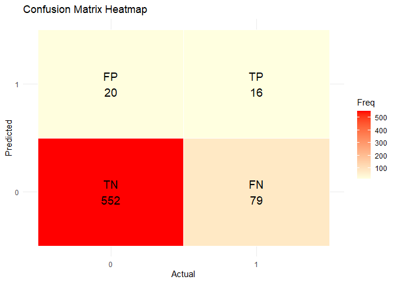

Summative Assessment 2
================
Cuerdo, Naomi Hannah A., Percia, Kyte Daiter M.
2025-05-13

#### Dataset Familiarization and Preparation

``` r
df_train <- read.csv("C:\\Users\\naomi\\Downloads\\churn-bigml-80.csv")
df_test <- read.csv("C:\\Users\\naomi\\Downloads\\churn-bigml-20.csv")
```

``` r
glimpse(df_train)
```

    ## Rows: 2,666
    ## Columns: 20
    ## $ State                  <chr> "KS", "OH", "NJ", "OH", "OK", "AL", "MA", "MO",…
    ## $ Account.length         <int> 128, 107, 137, 84, 75, 118, 121, 147, 141, 74, …
    ## $ Area.code              <int> 415, 415, 415, 408, 415, 510, 510, 415, 415, 41…
    ## $ International.plan     <chr> "No", "No", "No", "Yes", "Yes", "Yes", "No", "Y…
    ## $ Voice.mail.plan        <chr> "Yes", "Yes", "No", "No", "No", "No", "Yes", "N…
    ## $ Number.vmail.messages  <int> 25, 26, 0, 0, 0, 0, 24, 0, 37, 0, 0, 0, 0, 27, …
    ## $ Total.day.minutes      <dbl> 265.1, 161.6, 243.4, 299.4, 166.7, 223.4, 218.2…
    ## $ Total.day.calls        <int> 110, 123, 114, 71, 113, 98, 88, 79, 84, 127, 96…
    ## $ Total.day.charge       <dbl> 45.07, 27.47, 41.38, 50.90, 28.34, 37.98, 37.09…
    ## $ Total.eve.minutes      <dbl> 197.4, 195.5, 121.2, 61.9, 148.3, 220.6, 348.5,…
    ## $ Total.eve.calls        <int> 99, 103, 110, 88, 122, 101, 108, 94, 111, 148, …
    ## $ Total.eve.charge       <dbl> 16.78, 16.62, 10.30, 5.26, 12.61, 18.75, 29.62,…
    ## $ Total.night.minutes    <dbl> 244.7, 254.4, 162.6, 196.9, 186.9, 203.9, 212.6…
    ## $ Total.night.calls      <int> 91, 103, 104, 89, 121, 118, 118, 96, 97, 94, 12…
    ## $ Total.night.charge     <dbl> 11.01, 11.45, 7.32, 8.86, 8.41, 9.18, 9.57, 9.5…
    ## $ Total.intl.minutes     <dbl> 10.0, 13.7, 12.2, 6.6, 10.1, 6.3, 7.5, 7.1, 11.…
    ## $ Total.intl.calls       <int> 3, 3, 5, 7, 3, 6, 7, 6, 5, 5, 2, 5, 6, 4, 3, 5,…
    ## $ Total.intl.charge      <dbl> 2.70, 3.70, 3.29, 1.78, 2.73, 1.70, 2.03, 1.92,…
    ## $ Customer.service.calls <int> 1, 1, 0, 2, 3, 0, 3, 0, 0, 0, 1, 3, 4, 1, 3, 1,…
    ## $ Churn                  <chr> "False", "False", "False", "False", "False", "F…

``` r
glimpse(df_test)
```

    ## Rows: 667
    ## Columns: 20
    ## $ State                  <chr> "LA", "IN", "NY", "SC", "HI", "AK", "MI", "ID",…
    ## $ Account.length         <int> 117, 65, 161, 111, 49, 36, 65, 119, 10, 68, 74,…
    ## $ Area.code              <int> 408, 415, 415, 415, 510, 408, 415, 415, 408, 41…
    ## $ International.plan     <chr> "No", "No", "No", "No", "No", "No", "No", "No",…
    ## $ Voice.mail.plan        <chr> "No", "No", "No", "No", "No", "Yes", "No", "No"…
    ## $ Number.vmail.messages  <int> 0, 0, 0, 0, 0, 30, 0, 0, 0, 0, 33, 0, 0, 29, 0,…
    ## $ Total.day.minutes      <dbl> 184.5, 129.1, 332.9, 110.4, 119.3, 146.3, 211.3…
    ## $ Total.day.calls        <int> 97, 137, 67, 103, 117, 128, 120, 114, 112, 70, …
    ## $ Total.day.charge       <dbl> 31.37, 21.95, 56.59, 18.77, 20.28, 24.87, 35.92…
    ## $ Total.eve.minutes      <dbl> 351.6, 228.5, 317.8, 137.3, 215.1, 162.5, 162.6…
    ## $ Total.eve.calls        <int> 80, 83, 97, 102, 109, 80, 122, 117, 66, 164, 96…
    ## $ Total.eve.charge       <dbl> 29.89, 19.42, 27.01, 11.67, 18.28, 13.81, 13.82…
    ## $ Total.night.minutes    <dbl> 215.8, 208.8, 160.6, 189.6, 178.7, 129.3, 134.7…
    ## $ Total.night.calls      <int> 90, 111, 128, 105, 90, 109, 118, 91, 57, 103, 9…
    ## $ Total.night.charge     <dbl> 9.71, 9.40, 7.23, 8.53, 8.04, 5.82, 6.06, 6.44,…
    ## $ Total.intl.minutes     <dbl> 8.7, 12.7, 5.4, 7.7, 11.1, 14.5, 13.2, 8.8, 11.…
    ## $ Total.intl.calls       <int> 4, 6, 9, 6, 1, 6, 5, 3, 6, 3, 3, 3, 3, 7, 4, 4,…
    ## $ Total.intl.charge      <dbl> 2.35, 3.43, 1.46, 2.08, 3.00, 3.92, 3.56, 2.38,…
    ## $ Customer.service.calls <int> 1, 4, 4, 2, 1, 0, 3, 5, 2, 3, 2, 0, 2, 0, 0, 0,…
    ## $ Churn                  <chr> "False", "True", "True", "False", "False", "Fal…

#### Perform Data Cleaning

Dropping non-predictive identifiers like phone number and state:

``` r
df_train <- df_train %>%
  select(-State, - Area.code)

df_test <- df_test %>%
  select(-State, - Area.code)
```

Converting ‘Churn’ to numeric (0 = FALSE, 1 = TRUE)

``` r
df_train$Churn <- ifelse(df_train$Churn == "True", 1, 0)
df_test$Churn <- ifelse(df_test$Churn == "True", 1, 0)

table(df_train$Churn)
```

    ## 
    ##    0    1 
    ## 2278  388

``` r
table(df_test$Churn)
```

    ## 
    ##   0   1 
    ## 572  95

Converting categorical variables to factors:

``` r
df_train_encoded <- dummy_cols(df_train, select_columns = c("International.plan",
                                                            "Voice.mail.plan"),
                               remove_first_dummy = TRUE,           
                               remove_selected_columns = TRUE)       
df_test_encoded <- dummy_cols(df_test,
                              select_columns = c("International.plan",
                                                 "Voice.mail.plan"),
                              remove_first_dummy = TRUE,
                              remove_selected_columns = TRUE)
```

Checking the output:

``` r
colnames(df_train_encoded)
```

    ##  [1] "Account.length"         "Number.vmail.messages"  "Total.day.minutes"     
    ##  [4] "Total.day.calls"        "Total.day.charge"       "Total.eve.minutes"     
    ##  [7] "Total.eve.calls"        "Total.eve.charge"       "Total.night.minutes"   
    ## [10] "Total.night.calls"      "Total.night.charge"     "Total.intl.minutes"    
    ## [13] "Total.intl.calls"       "Total.intl.charge"      "Customer.service.calls"
    ## [16] "Churn"                  "International.plan_Yes" "Voice.mail.plan_Yes"

``` r
colnames(df_train_encoded)
```

    ##  [1] "Account.length"         "Number.vmail.messages"  "Total.day.minutes"     
    ##  [4] "Total.day.calls"        "Total.day.charge"       "Total.eve.minutes"     
    ##  [7] "Total.eve.calls"        "Total.eve.charge"       "Total.night.minutes"   
    ## [10] "Total.night.calls"      "Total.night.charge"     "Total.intl.minutes"    
    ## [13] "Total.intl.calls"       "Total.intl.charge"      "Customer.service.calls"
    ## [16] "Churn"                  "International.plan_Yes" "Voice.mail.plan_Yes"

``` r
head(df_train_encoded[c("International.plan_Yes", "Voice.mail.plan_Yes")])
```

    ##   International.plan_Yes Voice.mail.plan_Yes
    ## 1                      0                   1
    ## 2                      0                   1
    ## 3                      0                   0
    ## 4                      1                   0
    ## 5                      1                   0
    ## 6                      1                   0

Now that the data is cleaned, we can now proceed with the Exploratory
Data Analysis and Modeling.

#### Exploratory Data Analysis

Summarize Key Features:

``` r
churn_rate <- df_train %>%
  count(Churn) %>%
  mutate(Percentage = n /sum(n) * 100)
churn_rate
```

    ##   Churn    n Percentage
    ## 1     0 2278   85.44636
    ## 2     1  388   14.55364

A total of 2278 customers did not churn, which means that they stayed
with the company. Meanwhile, 388 customers (or 14.55%) did churn - they
left or cancelled the service.

``` r
ggplot(df_train, aes(x = Total.day.minutes, fill = as.factor(Churn))) + 
  geom_histogram(bins = 30, position = "identity", alpha = 0.6) +
  labs(title = "Distribution of Total Day Minutes by Churn", fill = "Churn") 
```

<!-- -->

The histogram shows the distribution of total day minutes used by
customers, segmented whether they churned or not.

Most non-churning customers (red) used between 150 to 250 minutes per
day. This is where the red bars are tallest. Meanwhile Churning
customers (blue) are more spread out and more heavily represented at the
higher end of day minutes (e.g., 250–350 minutes). This suggests that
customers who churned tended to use more day minutes on average compared
to those who stayed.

Check Correlation Among Numerical Variables

``` r
numeric_data <- select_if(df_train, is.numeric)

cor_matrix <- cor(numeric_data, use = "complete.obs")

corrplot(cor_matrix, method = "color", type = "upper", tl.cex = 0.8)
```

<!-- -->
Based from the heatmap, it shows that Total.day.minutes and
Total.day.charge have a very high positive correlation.
Customer.service.calls have a moderative positive relation with Churn,
suggesting that day-time users are more likely to leave.
Total.night.minutes or Total.intl. calls show weak positive correlation.

Examine Class Imbalance

``` r
ggplot(df_train, aes(x = as.factor(Churn))) +
  geom_bar(fill = c("#2c7fb8", "#f03b20")) +
  labs(title = "Churn Class Distribution", x = "Churn", y = "Count") +
  theme_minimal()
```

<!-- -->

The distribution above confirms the Churn rate, which contains that
around 2000 are customers who did not churn, and those who did are only
at around 300.

#### Model

Features and target variables:

``` r
x_train <- df_train_encoded %>% select(-Churn)
y_train <- df_train_encoded$Churn

x_test <- df_test_encoded %>% select(-Churn)
y_test <- df_test_encoded$Churn
```

Logistic Regression

``` r
# Train
log_model <- glm(Churn ~ ., data = df_train_encoded, family = "binomial")

# Predict
log_probs <- predict(log_model, newdata = df_test_encoded, type = "response")
log_preds <- ifelse(log_probs > 0.5, 1, 0)

# Evaluation
confusionMatrix(factor(log_preds), factor(y_test))
```

    ## Confusion Matrix and Statistics
    ## 
    ##           Reference
    ## Prediction   0   1
    ##          0 552  79
    ##          1  20  16
    ##                                           
    ##                Accuracy : 0.8516          
    ##                  95% CI : (0.8223, 0.8777)
    ##     No Information Rate : 0.8576          
    ##     P-Value [Acc > NIR] : 0.6944          
    ##                                           
    ##                   Kappa : 0.1801          
    ##                                           
    ##  Mcnemar's Test P-Value : 5.569e-09       
    ##                                           
    ##             Sensitivity : 0.9650          
    ##             Specificity : 0.1684          
    ##          Pos Pred Value : 0.8748          
    ##          Neg Pred Value : 0.4444          
    ##              Prevalence : 0.8576          
    ##          Detection Rate : 0.8276          
    ##    Detection Prevalence : 0.9460          
    ##       Balanced Accuracy : 0.5667          
    ##                                           
    ##        'Positive' Class : 0               
    ## 

``` r
roc_obj_log <- roc(y_test, log_probs)
```

    ## Setting levels: control = 0, case = 1

    ## Setting direction: controls < cases

``` r
auc(roc_obj_log)
```

    ## Area under the curve: 0.826

Confusion Matrix Heatmap

``` r
cm <- confusionMatrix(factor(log_preds), factor(y_test))
cm_table <- as.table(cm$table)

cm_df <- as.data.frame(cm_table)
colnames(cm_df) <- c("Predicted", "Actual", "Freq")

cm_df$Label <- c("TN", "FP", "FN", "TP")  # Order is correct if factors are 0 and 1

ggplot(cm_df, aes(x = Actual, y = Predicted, fill = Freq)) +
  geom_tile(color = "white") +
  geom_text(aes(label = paste0(Label, "\n", Freq)), size = 5) +
  scale_fill_gradient(low = "lightyellow", high = "red") +
  labs(title = "Confusion Matrix Heatmap", x = "Actual", y = "Predicted") +
  theme_minimal()
```

<!-- -->

Plotting the Logistic Regression Model using the ROC Curve

``` r
roc_log <- roc(y_test, log_probs)
```

    ## Setting levels: control = 0, case = 1

    ## Setting direction: controls < cases

``` r
plot(roc_log, main = "ROC Curve - Logistic Regression", col = "blue")
```

<!-- -->

Ridge and Lasso Regression

``` r
x_train_mat <- model.matrix(Churn ~ ., data = df_train_encoded)[, -1]
y_train_vec <- df_train_encoded$Churn
x_test_mat <- model.matrix(Churn ~ ., data = df_test_encoded)[, -1]

# Ridge Regression (alpha = 0)
ridge_model <- cv.glmnet(x_train_mat, y_train_vec, alpha = 0, family = "binomial")
ridge_probs <- predict(ridge_model, s = ridge_model$lambda.min, newx = x_test_mat, type = "response")
ridge_preds <- ifelse(ridge_probs > 0.5, 1, 0)

confusionMatrix(factor(ridge_preds), factor(y_test))
```

    ## Confusion Matrix and Statistics
    ## 
    ##           Reference
    ## Prediction   0   1
    ##          0 555  80
    ##          1  17  15
    ##                                           
    ##                Accuracy : 0.8546          
    ##                  95% CI : (0.8255, 0.8805)
    ##     No Information Rate : 0.8576          
    ##     P-Value [Acc > NIR] : 0.6138          
    ##                                           
    ##                   Kappa : 0.1772          
    ##                                           
    ##  Mcnemar's Test P-Value : 3.071e-10       
    ##                                           
    ##             Sensitivity : 0.9703          
    ##             Specificity : 0.1579          
    ##          Pos Pred Value : 0.8740          
    ##          Neg Pred Value : 0.4688          
    ##              Prevalence : 0.8576          
    ##          Detection Rate : 0.8321          
    ##    Detection Prevalence : 0.9520          
    ##       Balanced Accuracy : 0.5641          
    ##                                           
    ##        'Positive' Class : 0               
    ## 

``` r
roc_obj_ridge <- roc(y_test, as.vector(ridge_probs))
```

    ## Setting levels: control = 0, case = 1

    ## Setting direction: controls < cases

``` r
auc(roc_obj_ridge)
```

    ## Area under the curve: 0.8255

``` r
# Lasso Regression (alpha = 1)
lasso_model <- cv.glmnet(x_train_mat, y_train_vec, alpha = 1, family = "binomial")
lasso_probs <- predict(lasso_model, s = lasso_model$lambda.min, newx = x_test_mat, type = "response")
lasso_preds <- ifelse(lasso_probs > 0.5, 1, 0)

confusionMatrix(factor(lasso_preds), factor(y_test))
```

    ## Confusion Matrix and Statistics
    ## 
    ##           Reference
    ## Prediction   0   1
    ##          0 552  77
    ##          1  20  18
    ##                                           
    ##                Accuracy : 0.8546          
    ##                  95% CI : (0.8255, 0.8805)
    ##     No Information Rate : 0.8576          
    ##     P-Value [Acc > NIR] : 0.6138          
    ##                                           
    ##                   Kappa : 0.2061          
    ##                                           
    ##  Mcnemar's Test P-Value : 1.301e-08       
    ##                                           
    ##             Sensitivity : 0.9650          
    ##             Specificity : 0.1895          
    ##          Pos Pred Value : 0.8776          
    ##          Neg Pred Value : 0.4737          
    ##              Prevalence : 0.8576          
    ##          Detection Rate : 0.8276          
    ##    Detection Prevalence : 0.9430          
    ##       Balanced Accuracy : 0.5773          
    ##                                           
    ##        'Positive' Class : 0               
    ## 

``` r
roc_obj_lasso <- roc(y_test, as.vector(lasso_probs))
```

    ## Setting levels: control = 0, case = 1
    ## Setting direction: controls < cases

``` r
auc(roc_obj_lasso)
```

    ## Area under the curve: 0.8263

``` r
par(mar = c(5, 4, 5, 2))  # bottom, left, top, right margins
plot(ridge_model, main = "Ridge: Cross-Validation Curve")
```

<!-- -->

``` r
plot(lasso_model, main = "Lasso: Cross-Validation Curve")
```

<!-- -->

Decision tree

``` r
tree_model <- rpart(Churn ~ ., data = df_train_encoded, method = "class")
tree_preds <- predict(tree_model, newdata = df_test_encoded, type = "class")

confusionMatrix(tree_preds, factor(y_test))
```

    ## Confusion Matrix and Statistics
    ## 
    ##           Reference
    ## Prediction   0   1
    ##          0 563  20
    ##          1   9  75
    ##                                           
    ##                Accuracy : 0.9565          
    ##                  95% CI : (0.9382, 0.9707)
    ##     No Information Rate : 0.8576          
    ##     P-Value [Acc > NIR] : < 2e-16         
    ##                                           
    ##                   Kappa : 0.813           
    ##                                           
    ##  Mcnemar's Test P-Value : 0.06332         
    ##                                           
    ##             Sensitivity : 0.9843          
    ##             Specificity : 0.7895          
    ##          Pos Pred Value : 0.9657          
    ##          Neg Pred Value : 0.8929          
    ##              Prevalence : 0.8576          
    ##          Detection Rate : 0.8441          
    ##    Detection Prevalence : 0.8741          
    ##       Balanced Accuracy : 0.8869          
    ##                                           
    ##        'Positive' Class : 0               
    ## 

``` r
rpart.plot(tree_model, 
           type = 2, 
           extra = 106, 
           fallen.leaves = TRUE, 
           main = "Decision Tree for Churn Prediction")
```

<!-- -->

``` r
rf_model <- randomForest(x = x_train, y = as.factor(y_train), ntree = 100)
rf_preds <- predict(rf_model, newdata = x_test)

confusionMatrix(rf_preds, factor(y_test))
```

    ## Confusion Matrix and Statistics
    ## 
    ##           Reference
    ## Prediction   0   1
    ##          0 567  28
    ##          1   5  67
    ##                                           
    ##                Accuracy : 0.9505          
    ##                  95% CI : (0.9312, 0.9657)
    ##     No Information Rate : 0.8576          
    ##     P-Value [Acc > NIR] : 6.764e-15       
    ##                                           
    ##                   Kappa : 0.7747          
    ##                                           
    ##  Mcnemar's Test P-Value : 0.0001283       
    ##                                           
    ##             Sensitivity : 0.9913          
    ##             Specificity : 0.7053          
    ##          Pos Pred Value : 0.9529          
    ##          Neg Pred Value : 0.9306          
    ##              Prevalence : 0.8576          
    ##          Detection Rate : 0.8501          
    ##    Detection Prevalence : 0.8921          
    ##       Balanced Accuracy : 0.8483          
    ##                                           
    ##        'Positive' Class : 0               
    ## 

``` r
varImpPlot(rf_model)
```

<!-- -->

Gradient Boosting

``` r
# Convert to matrix for xgboost
xgb_train <- xgb.DMatrix(data = as.matrix(x_train), label = y_train)
xgb_test <- xgb.DMatrix(data = as.matrix(x_test), label = y_test)

# Train the model
xgb_model <- xgboost(data = xgb_train, nrounds = 100, objective = "binary:logistic", verbose = 0)

# Predict
xgb_probs <- predict(xgb_model, xgb_test)
xgb_preds <- ifelse(xgb_probs > 0.5, 1, 0)

confusionMatrix(factor(xgb_preds), factor(y_test))
```

    ## Confusion Matrix and Statistics
    ## 
    ##           Reference
    ## Prediction   0   1
    ##          0 565  21
    ##          1   7  74
    ##                                           
    ##                Accuracy : 0.958           
    ##                  95% CI : (0.9399, 0.9719)
    ##     No Information Rate : 0.8576          
    ##     P-Value [Acc > NIR] : < 2e-16         
    ##                                           
    ##                   Kappa : 0.8169          
    ##                                           
    ##  Mcnemar's Test P-Value : 0.01402         
    ##                                           
    ##             Sensitivity : 0.9878          
    ##             Specificity : 0.7789          
    ##          Pos Pred Value : 0.9642          
    ##          Neg Pred Value : 0.9136          
    ##              Prevalence : 0.8576          
    ##          Detection Rate : 0.8471          
    ##    Detection Prevalence : 0.8786          
    ##       Balanced Accuracy : 0.8834          
    ##                                           
    ##        'Positive' Class : 0               
    ## 

``` r
roc_obj_xgb <- roc(y_test, xgb_probs)
```

    ## Setting levels: control = 0, case = 1

    ## Setting direction: controls < cases

``` r
auc(roc_obj_xgb)
```

    ## Area under the curve: 0.928

Feature Importance of Gradient Boosting

``` r
xgb_importance <- xgb.importance(model = xgb_model)
xgb.plot.importance(xgb_importance, top_n = 10, main = "XGBoost - Feature Importance")
```

<!-- -->
Combining all AUC Scores:

``` r
auc_scores <- data.frame(
  Model = c("Logistic", "Ridge", "Lasso", "XGBoost"),
  AUC = c(
    auc(roc_obj_log),
    auc(roc_obj_ridge),
    auc(roc_obj_lasso),
    auc(roc_obj_xgb)
  )
)

print(auc_scores)
```

    ##      Model       AUC
    ## 1 Logistic 0.8260397
    ## 2    Ridge 0.8255061
    ## 3    Lasso 0.8262606
    ## 4  XGBoost 0.9280272

#### Conclusion and Interpretation

Compiling all AUCs and accuracies:

``` r
log_auc <- auc(roc(y_test, log_probs))
```

    ## Setting levels: control = 0, case = 1

    ## Setting direction: controls < cases

``` r
ridge_auc <- auc(roc(y_test, as.vector(ridge_probs)))
```

    ## Setting levels: control = 0, case = 1
    ## Setting direction: controls < cases

``` r
lasso_auc <- auc(roc(y_test, as.vector(lasso_probs)))
```

    ## Setting levels: control = 0, case = 1
    ## Setting direction: controls < cases

``` r
xgb_auc <- auc(roc(y_test, xgb_probs))
```

    ## Setting levels: control = 0, case = 1
    ## Setting direction: controls < cases

``` r
model_performance <- data.frame(
  Model = c("Logistic Regression", "Ridge Regression", "Lasso Regression", "Random Forest", "XGBoost"),
  AUC = c(log_auc, ridge_auc, lasso_auc, NA, xgb_auc)  
)

model_performance
```

    ##                 Model       AUC
    ## 1 Logistic Regression 0.8260397
    ## 2    Ridge Regression 0.8255061
    ## 3    Lasso Regression 0.8262606
    ## 4       Random Forest        NA
    ## 5             XGBoost 0.9280272
